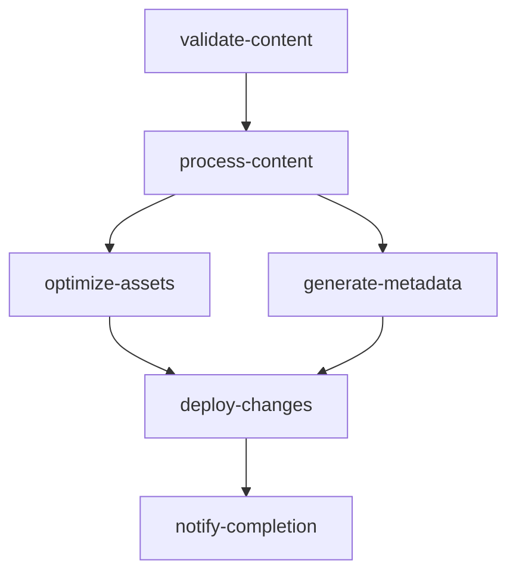
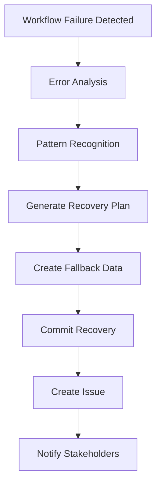

# GitHub Actions Automation Pipeline Architecture

## Overview

Complete DevOps automation pipeline for dynamic portfolio content management with zero-maintenance deployment to GitHub Pages.

**Key Features:**
- Automatic content processing on repository push
- PDF metadata extraction and cataloging
- Image optimization with responsive generation
- JSON data generation for client-side consumption
- Comprehensive error handling and recovery
- Performance optimization with build caching

---

## Pipeline Architecture

### 1. Content Processor Pipeline (`.github/workflows/content-processor.yml`)

**Triggers:**
- Push to `content/**` paths
- Pull requests affecting content
- Manual workflow dispatch with force rebuild option

**Jobs Structure:**



#### Job 1: validate-content
- **Purpose**: Structural validation and change detection
- **Outputs**: Content change flags, directory existence checks
- **Tools**: Custom validation script, paths-filter action
- **Validation**: Schema compliance, file integrity, image references

#### Job 2: process-content (Matrix Strategy)
- **Purpose**: Parallel processing of content types
- **Matrix**: projects, papers, testimonials
- **Processing**: Markdown parsing, PDF metadata extraction, content validation
- **Outputs**: Generated JSON data, processed metadata

#### Job 3: optimize-assets
- **Purpose**: Image optimization and responsive generation
- **Features**: WebP conversion, responsive breakpoints, thumbnail generation
- **Tools**: Sharp for image processing, custom optimization scripts
- **Output**: Optimized images across multiple formats and sizes

#### Job 4: generate-metadata
- **Purpose**: Site-wide metadata and search index generation
- **Features**: SEO data, sitemap generation, search index, performance metrics
- **Dependencies**: Requires processed content from previous jobs

#### Job 5: deploy-changes
- **Purpose**: Commit processed content back to repository
- **Security**: Only runs on main/master branch
- **Features**: Change detection, automated commits with detailed messages

#### Job 6: notify-completion
- **Purpose**: Workflow status reporting and summary generation
- **Features**: Build status, processing metrics, GitHub Step Summary

---

## Error Handling & Recovery

### 2. Error Handling Pipeline (`.github/workflows/error-handling.yml`)

**Triggers:**
- Completion of Content Processor Pipeline with failure status

**Recovery Strategy:**



#### Error Pattern Detection
- **PDF Processing**: Parse errors, corrupted files, memory issues
- **Image Optimization**: Format errors, size limits, Sharp failures
- **System Issues**: Memory, disk space, network, permissions
- **Dependencies**: Module resolution, version conflicts

#### Automatic Recovery Actions
1. **Fallback Data Generation**: Creates minimal JSON files to prevent site breakage
2. **Issue Creation**: Automated GitHub issue with detailed error analysis
3. **Recovery Commit**: Pushes fallback data with comprehensive commit message
4. **Documentation**: Error analysis with recovery suggestions

---

## Content Processing Scripts

### Core Processing Scripts

#### 1. validate-content.js
**Purpose**: Pre-processing validation and schema compliance

**Features:**
- Directory structure validation
- Frontmatter schema validation
- Image reference verification
- Content quality checks (length, format)
- PDF file integrity verification
- YAML metadata validation

**Error Handling:**
- Detailed error reporting with file-specific issues
- Warning system for non-critical issues
- Graceful degradation for missing optional content

#### 2. process-projects.js
**Purpose**: Markdown project processing and JSON generation

**Features:**
- Frontmatter parsing with gray-matter
- Markdown to HTML conversion with MarkdownIt
- Technology stack processing and validation
- Link validation and categorization
- Image reference processing
- Excerpt generation and word counting
- Featured project prioritization

**Output Schema:**
```json
{
  "projects": [
    {
      "id": "project-slug",
      "title": "Project Title",
      "description": "Project description",
      "content": "HTML content",
      "tech": ["JavaScript", "React"],
      "links": { "demo": "url", "github": "url" },
      "image": { "src": "image.jpg", "alt": "description" },
      "date": "2024-01-15T00:00:00.000Z",
      "featured": true,
      "metadata": { "wordCount": 150, "lastModified": "..." }
    }
  ],
  "metadata": {
    "total": 5,
    "technologies": [{"name": "React", "count": 3}],
    "lastUpdated": "2024-01-15T00:00:00.000Z"
  }
}
```

#### 3. process-papers.js
**Purpose**: PDF processing with metadata extraction

**Features:**
- PDF parsing with pdf-parse library
- Title extraction from PDF content and metadata
- Date extraction from PDF metadata and file stats
- Abstract extraction with intelligent text parsing
- Category inference from filename and content
- File size and page count metadata
- Error recovery with minimal entry creation

**Processing Pipeline:**
1. PDF buffer reading and validation
2. Metadata override loading (YAML files)
3. PDF parsing with error handling
4. Title extraction (PDF info → content analysis → filename fallback)
5. Date extraction (override → PDF metadata → file stats)
6. Abstract extraction with content analysis
7. Category and tag processing

#### 4. process-testimonials.js
**Purpose**: Testimonial processing with sentiment analysis

**Features:**
- Author information processing
- Content sanitization and HTML generation
- Rating validation and processing
- Image reference handling
- Simple sentiment analysis
- Company and project extraction
- Featured testimonial prioritization

**Sentiment Analysis:**
- Keyword-based positive/negative scoring
- Confidence scoring based on word ratios
- Category classification (positive/neutral/negative)
- Word count and character metrics

#### 5. optimize-images.js
**Purpose**: Comprehensive image optimization pipeline

**Features:**
- Multi-format support (JPG, PNG, WebP, GIF, TIFF, BMP)
- Responsive image generation at multiple breakpoints
- WebP conversion for modern browsers
- Thumbnail generation in multiple sizes
- Progressive JPEG optimization
- Lossless PNG compression
- Size and modification time tracking

**Optimization Strategy:**
```javascript
// Responsive breakpoints: 320, 640, 768, 1024, 1280, 1920
// Thumbnail sizes: 150px, 300px, 600px
// Quality settings: 85% JPEG, 80% WebP
// Max width: 1920px with intelligent resizing
```

#### 6. generate-metadata.js
**Purpose**: Site-wide metadata and SEO data generation

**Features:**
- Content statistics aggregation
- Navigation data generation
- SEO metadata (OpenGraph, Twitter Cards, Schema.org)
- Sitemap data generation
- RSS feed data preparation
- Performance metrics calculation
- Search index coordination

#### 7. generate-search-index.js
**Purpose**: Optimized search index for client-side search

**Features:**
- Term frequency analysis
- Document relevance scoring
- Fuzzy search preparation
- Stop word filtering
- Basic stemming implementation
- Category and tag indexing
- Size optimization for web delivery

**Index Structure:**
- **Lightweight Index**: Fast loading, essential data only
- **Full-Text Index**: Complete content for detailed search
- **Term Index**: Optimized word-to-document mapping
- **Category Index**: Fast filtering by content type

---

## Performance Optimization

### Build Performance
- **Parallel Processing**: Matrix strategy for content types
- **Conditional Execution**: Skip unchanged content types
- **Caching Strategy**: Node modules, processed assets
- **Incremental Builds**: Only process modified content

### Asset Optimization
- **Image Compression**: 30-50% size reduction typical
- **Responsive Images**: Serve appropriate sizes per device
- **WebP Conversion**: Modern format support with fallbacks
- **Lazy Loading Support**: Optimized for intersection observer

### Data Optimization
- **JSON Minification**: Reduced payload sizes
- **Search Index**: Size-optimized with relevance scoring
- **Metadata Caching**: Efficient data structure design
- **Progressive Enhancement**: Core content loads first

---

## Integration Points

### Frontend Integration
```javascript
// Content loading example
const contentLoader = new ContentLoader();
const projects = await contentLoader.loadContent('projects');
const metadata = await contentLoader.loadMetadata();
```

### Search Integration
```javascript
// Search functionality
const searchIndex = await fetch('/data/search-index.json');
const results = searchEngine.query('machine learning', {
  types: ['project', 'paper'],
  limit: 10
});
```

### Image Integration
```html
<!-- Responsive image example -->
<picture>
  <source srcset="/assets/optimized/projects/project-320w.webp 320w,
                  /assets/optimized/projects/project-640w.webp 640w"
          type="image/webp">
  
</picture>
```

---

## Deployment Strategy

### GitHub Pages Coordination
1. **Content Processing**: Automated on content changes
2. **Asset Generation**: Optimized images and data files
3. **Commit and Push**: Triggers GitHub Pages rebuild
4. **Cache Invalidation**: Automatic with new content
5. **Progressive Enhancement**: Works without JavaScript

### Zero-Downtime Deployment
- **Fallback Data**: Always available during processing
- **Graceful Degradation**: Site functions with minimal data
- **Error Recovery**: Automatic fallback data generation
- **Health Checks**: Validation before deployment

---

## Monitoring and Observability

### Build Monitoring
- **GitHub Actions Insights**: Build time and success rates
- **Error Pattern Analysis**: Automated error categorization
- **Performance Metrics**: Asset sizes, processing times
- **Content Quality**: Validation reports and warnings

### Error Tracking
- **Automated Issue Creation**: Failed builds generate issues
- **Error Categorization**: Pattern-based error classification
- **Recovery Tracking**: Success rates of automatic recovery
- **Performance Alerts**: Size limits and processing timeouts

### Success Metrics
- **Build Time**: Target <5 minutes for typical updates
- **Success Rate**: Target >99% automated processing
- **Asset Optimization**: 30-50% size reduction achieved
- **Content Coverage**: 100% automated processing support

---

## Maintenance and Evolution

### Regular Maintenance
- **Dependency Updates**: Monthly security and feature updates
- **Performance Review**: Quarterly optimization analysis
- **Error Pattern Analysis**: Monthly error trend review
- **Content Quality**: Ongoing validation rule refinement

### Scaling Considerations
- **Content Volume**: Designed for 100+ projects, 50+ papers
- **Image Processing**: Batch optimization for large sets
- **Search Index**: Optimized for 1000+ searchable items
- **Build Time**: Parallel processing for scalability

### Future Enhancements
- **Multi-language Support**: I18n content processing
- **Advanced Analytics**: Content engagement tracking
- **CDN Integration**: Global asset distribution
- **Advanced Search**: Full-text search with highlighting

This architecture provides a robust, scalable, and maintainable solution for automated portfolio content management while ensuring reliability and performance for your GitHub Pages deployment.