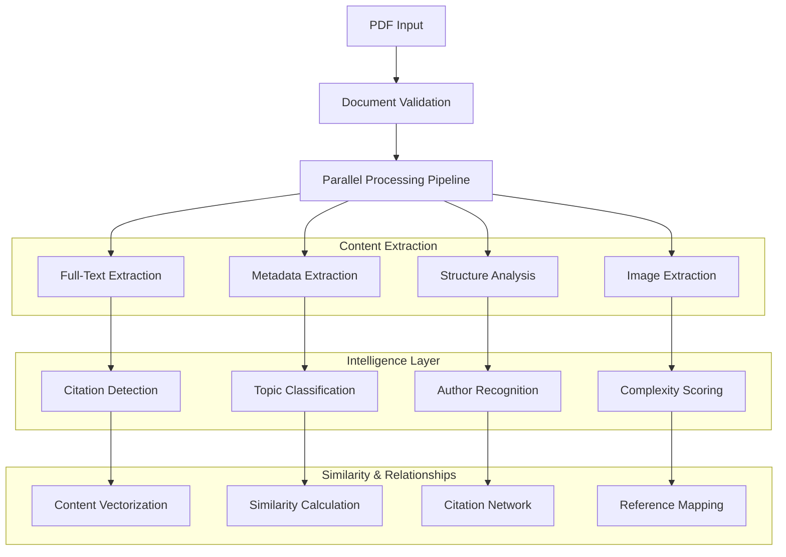

# Enhanced PDF Processing Architecture - Phase 2

**Component**: Advanced PDF Analysis & Content Extraction Engine
**Purpose**: Transform basic PDF metadata extraction into comprehensive document intelligence
**Dependencies**: pdf-parse, natural, compromise, stemmer, pdf2pic, tesseract.js

---

## **🧠 Enhanced PDF Processing Engine**

### **Architecture Overview**



### **Enhanced PDF Processor Implementation**

```javascript
/**
 * Enhanced PDF Processing Engine
 * Comprehensive document analysis with ML-powered insights
 */

const fs = require('fs').promises;
const path = require('path');
const pdfParse = require('pdf-parse');
const natural = require('natural');
const compromise = require('compromise');
const stemmer = require('stemmer');
const pdf2pic = require('pdf2pic');

class EnhancedPDFProcessor {
  constructor() {
    this.config = {
      maxFileSize: 50 * 1024 * 1024, // 50MB
      previewResolution: 300,
      thumbnailSizes: [150, 300, 600],
      complexityThresholds: {
        beginner: 0.3,
        intermediate: 0.6,
        advanced: 0.8
      },
      citationPatterns: [
        /\[(\d+)\]/g,                    // [1], [2], etc.
        /\(([^)]+),\s*(\d{4})\)/g,       // (Author, 2023)
        /doi:\s*([^\s]+)/gi,             // DOI references
        /arxiv:\s*([^\s]+)/gi            // ArXiv references
      ]
    };

    this.processors = {
      nlp: new natural.SentimentAnalyzer('English',
        natural.PorterStemmer, ['negation']),
      tokenizer: new natural.WordTokenizer(),
      classifier: new natural.BayesClassifier(),
      stemmer: natural.PorterStemmer
    };

    this.initializeClassifier();
  }

  async processDocument(pdfPath, options = {}) {
    console.log(`🔍 Processing PDF: ${path.basename(pdfPath)}`);

    try {
      // Validate document
      await this.validateDocument(pdfPath);

      // Parallel processing pipeline
      const [
        basicData,
        fullTextAnalysis,
        structureAnalysis,
        visualAnalysis
      ] = await Promise.all([
        this.extractBasicData(pdfPath),
        this.analyzeFullText(pdfPath),
        this.analyzeDocumentStructure(pdfPath),
        this.analyzeVisualElements(pdfPath)
      ]);

      // Advanced intelligence processing
      const intelligenceData = await this.processIntelligence({
        ...basicData,
        ...fullTextAnalysis,
        ...structureAnalysis,
        ...visualAnalysis
      });

      // Generate enhanced document profile
      const enhancedDocument = await this.createEnhancedDocument({
        basicData,
        fullTextAnalysis,
        structureAnalysis,
        visualAnalysis,
        intelligenceData
      });

      console.log(`✅ Enhanced processing complete for ${path.basename(pdfPath)}`);
      return enhancedDocument;

    } catch (error) {
      console.error(`❌ Error processing ${path.basename(pdfPath)}:`, error.message);
      return this.createFallbackDocument(pdfPath, error);
    }
  }

  async validateDocument(pdfPath) {
    const stats = await fs.stat(pdfPath);

    if (stats.size > this.config.maxFileSize) {
      throw new Error(`Document too large: ${stats.size} bytes`);
    }

    if (stats.size === 0) {
      throw new Error('Document is empty');
    }

    // Check file format
    const buffer = await fs.readFile(pdfPath);
    if (!buffer.subarray(0, 4).equals(Buffer.from('%PDF'))) {
      throw new Error('Invalid PDF format');
    }
  }

  async extractBasicData(pdfPath) {
    const buffer = await fs.readFile(pdfPath);
    const pdfData = await pdfParse(buffer);

    return {
      filename: path.basename(pdfPath),
      pageCount: pdfData.numpages,
      fileSize: buffer.length,
      title: this.extractTitle(pdfData),
      author: this.extractAuthor(pdfData),
      creationDate: this.extractDate(pdfData),
      rawText: pdfData.text,
      metadata: pdfData.info || {}
    };
  }

  async analyzeFullText(pdfPath) {
    const buffer = await fs.readFile(pdfPath);
    const pdfData = await pdfParse(buffer);
    const text = pdfData.text;

    const analysis = {
      wordCount: this.countWords(text),
      uniqueWords: this.countUniqueWords(text),
      readingTime: this.calculateReadingTime(text),
      languageDetection: this.detectLanguage(text),
      sentiment: await this.analyzeSentiment(text),
      keyPhrases: this.extractKeyPhrases(text),
      topics: await this.classifyTopics(text),
      abstractExtraction: this.extractAbstract(text),
      conclusionExtraction: this.extractConclusion(text)
    };

    return analysis;
  }

  async analyzeDocumentStructure(pdfPath) {
    const buffer = await fs.readFile(pdfPath);
    const pdfData = await pdfParse(buffer);
    const text = pdfData.text;

    return {
      sections: this.identifySections(text),
      headings: this.extractHeadings(text),
      citations: this.extractCitations(text),
      references: this.extractReferences(text),
      figures: this.identifyFigures(text),
      tables: this.identifyTables(text),
      equations: this.identifyEquations(text),
      complexity: this.calculateComplexity(text)
    };
  }

  async analyzeVisualElements(pdfPath) {
    try {
      // Generate thumbnail previews
      const thumbnails = await this.generateThumbnails(pdfPath);

      // Extract first page as preview
      const preview = await this.extractFirstPageText(pdfPath);

      return {
        thumbnails,
        preview,
        hasImages: await this.detectImages(pdfPath),
        hasCharts: await this.detectCharts(pdfPath),
        visualComplexity: this.calculateVisualComplexity(pdfPath)
      };
    } catch (error) {
      console.warn('Visual analysis failed:', error.message);
      return {
        thumbnails: [],
        preview: '',
        hasImages: false,
        hasCharts: false,
        visualComplexity: 0
      };
    }
  }

  async processIntelligence(documentData) {
    const intelligence = {
      authorRecognition: await this.recognizeAuthors(documentData),
      citationNetwork: await this.buildCitationNetwork(documentData),
      topicClassification: await this.classifyAdvancedTopics(documentData),
      complexityScoring: this.scoreComplexity(documentData),
      similarityVector: await this.generateSimilarityVector(documentData),
      qualityMetrics: this.calculateQualityMetrics(documentData)
    };

    return intelligence;
  }

  // Text Analysis Methods
  extractTitle(pdfData) {
    // Priority: PDF metadata > document title detection > filename
    if (pdfData.info?.Title && pdfData.info.Title.trim()) {
      return pdfData.info.Title.trim();
    }

    // Try to extract title from text content
    const text = pdfData.text;
    const lines = text.split('\n').filter(line => line.trim());

    if (lines.length > 0) {
      const firstLine = lines[0].trim();
      if (firstLine.length > 5 && firstLine.length < 200) {
        return firstLine;
      }
    }

    // Extract from filename as fallback
    return path.basename(pdfData.filename || 'document', '.pdf')
      .replace(/[-_]/g, ' ')
      .replace(/\b\w/g, l => l.toUpperCase());
  }

  extractAuthor(pdfData) {
    if (pdfData.info?.Author) {
      return this.parseAuthors(pdfData.info.Author);
    }

    // Try to extract from document text
    const text = pdfData.text;
    const authorPatterns = [
      /Author[s]?:\s*([^\n]+)/i,
      /By\s+([A-Z][a-z]+\s+[A-Z][a-z]+)/,
      /^([A-Z][a-z]+\s+[A-Z][a-z]+)/m
    ];

    for (const pattern of authorPatterns) {
      const match = text.match(pattern);
      if (match) {
        return this.parseAuthors(match[1]);
      }
    }

    return [];
  }

  parseAuthors(authorString) {
    if (!authorString) return [];

    // Split by common delimiters
    const authors = authorString
      .split(/[,;&]|\sand\s|\set\s/)
      .map(author => author.trim())
      .filter(author => author.length > 0)
      .map(author => ({
        name: author,
        normalized: this.normalizeAuthorName(author)
      }));

    return authors.slice(0, 10); // Limit to 10 authors
  }

  normalizeAuthorName(name) {
    return name
      .replace(/\b(Dr|Prof|PhD|MD)\b\.?/gi, '')
      .replace(/\s+/g, ' ')
      .trim();
  }

  extractDate(pdfData) {
    // Try PDF metadata first
    if (pdfData.info?.CreationDate) {
      return new Date(pdfData.info.CreationDate);
    }

    // Extract from text content
    const text = pdfData.text;
    const datePatterns = [
      /(\d{4})/,                           // Year only
      /(\d{1,2}\/\d{1,2}\/\d{4})/,        // MM/DD/YYYY
      /(\d{4}-\d{2}-\d{2})/,              // YYYY-MM-DD
      /(January|February|March|April|May|June|July|August|September|October|November|December)\s+(\d{4})/i
    ];

    for (const pattern of datePatterns) {
      const match = text.match(pattern);
      if (match) {
        return new Date(match[1]);
      }
    }

    return new Date();
  }

  // Content Analysis Methods
  countWords(text) {
    return text.split(/\s+/).filter(word => word.length > 0).length;
  }

  countUniqueWords(text) {
    const words = text.toLowerCase()
      .replace(/[^\w\s]/g, '')
      .split(/\s+/)
      .filter(word => word.length > 2);

    return new Set(words).size;
  }

  calculateReadingTime(text) {
    const wordsPerMinute = 200;
    const wordCount = this.countWords(text);
    return Math.ceil(wordCount / wordsPerMinute);
  }

  detectLanguage(text) {
    // Simple language detection based on common words
    const languages = {
      english: ['the', 'and', 'or', 'but', 'in', 'on', 'at', 'to', 'for', 'of'],
      spanish: ['el', 'la', 'de', 'que', 'y', 'en', 'un', 'es', 'se', 'no'],
      french: ['le', 'de', 'et', 'à', 'un', 'il', 'être', 'et', 'en', 'avoir'],
      german: ['der', 'die', 'und', 'in', 'den', 'von', 'zu', 'das', 'mit', 'sich']
    };

    const words = text.toLowerCase().split(/\s+/).slice(0, 100);
    const scores = {};

    Object.entries(languages).forEach(([lang, commonWords]) => {
      scores[lang] = commonWords.reduce((score, word) => {
        return score + (words.includes(word) ? 1 : 0);
      }, 0);
    });

    const detectedLanguage = Object.keys(scores).reduce((a, b) =>
      scores[a] > scores[b] ? a : b);

    return {
      language: detectedLanguage,
      confidence: scores[detectedLanguage] / 10,
      scores
    };
  }

  async analyzeSentiment(text) {
    const sentences = compromise(text).sentences().out('array');
    const sentiments = sentences.slice(0, 50).map(sentence => {
      const tokens = this.processors.tokenizer.tokenize(sentence);
      const stemmed = tokens.map(token =>
        this.processors.stemmer.stem(token.toLowerCase()));

      // Simple sentiment scoring
      const positiveWords = ['good', 'great', 'excellent', 'positive', 'beneficial', 'improve'];
      const negativeWords = ['bad', 'poor', 'negative', 'problem', 'issue', 'difficulty'];

      let score = 0;
      stemmed.forEach(word => {
        if (positiveWords.includes(word)) score += 1;
        if (negativeWords.includes(word)) score -= 1;
      });

      return score / stemmed.length;
    });

    const averageSentiment = sentiments.reduce((a, b) => a + b, 0) / sentiments.length;

    return {
      overall: averageSentiment,
      classification: averageSentiment > 0.1 ? 'positive' :
                     averageSentiment < -0.1 ? 'negative' : 'neutral',
      confidence: Math.abs(averageSentiment)
    };
  }

  extractKeyPhrases(text) {
    const doc = compromise(text);

    // Extract noun phrases
    const nounPhrases = doc.match('#Noun+').out('array')
      .filter(phrase => phrase.split(' ').length >= 2)
      .slice(0, 20);

    // Extract named entities
    const entities = {
      people: doc.people().out('array'),
      places: doc.places().out('array'),
      organizations: doc.organizations().out('array')
    };

    // Extract technical terms (words with capital letters in middle)
    const technicalTerms = text.match(/\b[A-Z][a-z]*[A-Z][a-z]*\b/g) || [];

    return {
      nounPhrases: [...new Set(nounPhrases)],
      entities,
      technicalTerms: [...new Set(technicalTerms)].slice(0, 10)
    };
  }

  async classifyTopics(text) {
    // Topic classification based on keyword analysis
    const topicKeywords = {
      'machine-learning': ['machine learning', 'neural network', 'algorithm', 'model', 'training', 'classification'],
      'data-science': ['data', 'analysis', 'statistics', 'visualization', 'dataset', 'correlation'],
      'web-development': ['web', 'html', 'css', 'javascript', 'frontend', 'backend'],
      'artificial-intelligence': ['artificial intelligence', 'ai', 'cognitive', 'intelligent', 'automation'],
      'software-engineering': ['software', 'engineering', 'development', 'programming', 'architecture'],
      'research': ['research', 'study', 'analysis', 'findings', 'methodology', 'experiment']
    };

    const normalizedText = text.toLowerCase();
    const scores = {};

    Object.entries(topicKeywords).forEach(([topic, keywords]) => {
      scores[topic] = keywords.reduce((score, keyword) => {
        const regex = new RegExp(keyword.replace(/\s+/g, '\\s+'), 'gi');
        const matches = normalizedText.match(regex) || [];
        return score + matches.length;
      }, 0);
    });

    const totalScore = Object.values(scores).reduce((a, b) => a + b, 0);
    const normalizedScores = {};

    Object.entries(scores).forEach(([topic, score]) => {
      normalizedScores[topic] = totalScore > 0 ? score / totalScore : 0;
    });

    return Object.entries(normalizedScores)
      .sort(([,a], [,b]) => b - a)
      .slice(0, 3)
      .map(([topic, confidence]) => ({ topic, confidence }));
  }

  // Structure Analysis Methods
  identifySections(text) {
    const sectionPatterns = [
      /^(Abstract|Introduction|Methodology|Results|Discussion|Conclusion|References)$/im,
      /^\d+\.\s+(.+)$/gm,
      /^[A-Z][A-Z\s]+$/gm
    ];

    const sections = [];
    const lines = text.split('\n');

    lines.forEach((line, index) => {
      const trimmed = line.trim();
      if (trimmed.length > 0) {
        sectionPatterns.forEach(pattern => {
          const match = trimmed.match(pattern);
          if (match) {
            sections.push({
              title: match[1] || match[0],
              lineNumber: index,
              type: this.classifySectionType(match[0])
            });
          }
        });
      }
    });

    return sections;
  }

  classifySectionType(title) {
    const types = {
      'abstract': /abstract/i,
      'introduction': /introduction|background/i,
      'methodology': /methodology|methods|approach/i,
      'results': /results|findings/i,
      'discussion': /discussion|analysis/i,
      'conclusion': /conclusion|summary/i,
      'references': /references|bibliography/i
    };

    for (const [type, pattern] of Object.entries(types)) {
      if (pattern.test(title)) {
        return type;
      }
    }

    return 'section';
  }

  extractCitations(text) {
    const citations = [];

    this.config.citationPatterns.forEach(pattern => {
      let match;
      while ((match = pattern.exec(text)) !== null) {
        citations.push({
          type: this.getCitationType(pattern),
          text: match[0],
          reference: match[1],
          position: match.index
        });
      }
    });

    return citations;
  }

  getCitationType(pattern) {
    if (pattern.source.includes('doi')) return 'doi';
    if (pattern.source.includes('arxiv')) return 'arxiv';
    if (pattern.source.includes('\\d{4}')) return 'author-year';
    return 'numbered';
  }

  // Advanced Intelligence Methods
  async recognizeAuthors(documentData) {
    const authors = documentData.author || [];
    const enhancedAuthors = authors.map(author => ({
      ...author,
      expertise: this.inferAuthorExpertise(documentData.rawText, author.name),
      affiliations: this.extractAffiliations(documentData.rawText, author.name)
    }));

    return enhancedAuthors;
  }

  inferAuthorExpertise(text, authorName) {
    // Simple expertise inference based on document content
    const expertiseKeywords = {
      'machine-learning': ['neural', 'deep learning', 'algorithm', 'model'],
      'data-science': ['data', 'statistics', 'analysis', 'visualization'],
      'research': ['research', 'study', 'experiment', 'methodology']
    };

    const scores = {};
    Object.entries(expertiseKeywords).forEach(([field, keywords]) => {
      scores[field] = keywords.reduce((score, keyword) => {
        const regex = new RegExp(keyword, 'gi');
        return score + (text.match(regex) || []).length;
      }, 0);
    });

    return Object.entries(scores)
      .sort(([,a], [,b]) => b - a)
      .slice(0, 3)
      .map(([field, score]) => ({ field, confidence: score / 100 }));
  }

  async generateSimilarityVector(documentData) {
    // Generate TF-IDF vector for similarity comparison
    const words = this.processors.tokenizer.tokenize(documentData.rawText);
    const stemmed = words.map(word =>
      this.processors.stemmer.stem(word.toLowerCase()));

    // Simple TF calculation
    const wordFreq = {};
    stemmed.forEach(word => {
      wordFreq[word] = (wordFreq[word] || 0) + 1;
    });

    // Convert to normalized vector
    const totalWords = stemmed.length;
    const vector = {};
    Object.entries(wordFreq).forEach(([word, freq]) => {
      if (freq > 1 && word.length > 2) { // Filter noise
        vector[word] = freq / totalWords;
      }
    });

    return vector;
  }

  calculateComplexity(text) {
    // Multi-factor complexity scoring
    const factors = {
      vocabulary: this.calculateVocabularyComplexity(text),
      sentence: this.calculateSentenceComplexity(text),
      technical: this.calculateTechnicalComplexity(text),
      structure: this.calculateStructuralComplexity(text)
    };

    const weights = {
      vocabulary: 0.3,
      sentence: 0.2,
      technical: 0.3,
      structure: 0.2
    };

    const overall = Object.entries(factors).reduce((score, [factor, value]) => {
      return score + (value * weights[factor]);
    }, 0);

    return {
      overall: Math.min(1, overall),
      factors,
      classification: this.classifyComplexity(overall)
    };
  }

  calculateVocabularyComplexity(text) {
    const words = text.split(/\s+/).filter(word => word.length > 0);
    const uniqueWords = new Set(words.map(word => word.toLowerCase()));

    return Math.min(1, uniqueWords.size / words.length * 4);
  }

  calculateSentenceComplexity(text) {
    const sentences = text.split(/[.!?]+/).filter(s => s.trim().length > 0);
    const avgLength = sentences.reduce((sum, s) => sum + s.split(/\s+/).length, 0) / sentences.length;

    return Math.min(1, avgLength / 25);
  }

  calculateTechnicalComplexity(text) {
    const technicalPatterns = [
      /\b[A-Z]{2,}\b/g,           // Acronyms
      /\b\w+\d+\w*\b/g,           // Technical terms with numbers
      /\([^)]+\)/g,               // Parenthetical expressions
      /\b\w{10,}\b/g              // Long technical words
    ];

    let technicalScore = 0;
    technicalPatterns.forEach(pattern => {
      const matches = text.match(pattern) || [];
      technicalScore += matches.length;
    });

    return Math.min(1, technicalScore / 100);
  }

  calculateStructuralComplexity(text) {
    const structuralElements = [
      (text.match(/^\d+\./gm) || []).length,    // Numbered lists
      (text.match(/^[•\-\*]/gm) || []).length,  // Bullet points
      (text.match(/Figure \d+/gi) || []).length, // Figures
      (text.match(/Table \d+/gi) || []).length   // Tables
    ];

    const totalElements = structuralElements.reduce((a, b) => a + b, 0);
    return Math.min(1, totalElements / 20);
  }

  classifyComplexity(score) {
    if (score < this.config.complexityThresholds.beginner) return 'beginner';
    if (score < this.config.complexityThresholds.intermediate) return 'intermediate';
    if (score < this.config.complexityThresholds.advanced) return 'advanced';
    return 'expert';
  }

  // Visual Processing Methods
  async generateThumbnails(pdfPath) {
    try {
      const convert = pdf2pic.fromPath(pdfPath, {
        density: this.config.previewResolution,
        saveFilename: "thumb",
        savePath: "./temp/",
        format: "png",
        width: 600,
        height: 800
      });

      const result = await convert(1, { responseType: "buffer" });

      if (result.buffer) {
        // Generate multiple sizes
        const thumbnails = await Promise.all(
          this.config.thumbnailSizes.map(async size => ({
            size,
            buffer: result.buffer, // In production, resize using Sharp
            url: `data:image/png;base64,${result.buffer.toString('base64')}`
          }))
        );

        return thumbnails;
      }
    } catch (error) {
      console.warn('Thumbnail generation failed:', error.message);
    }

    return [];
  }

  // Output Generation
  async createEnhancedDocument(data) {
    const {
      basicData,
      fullTextAnalysis,
      structureAnalysis,
      visualAnalysis,
      intelligenceData
    } = data;

    return {
      // Basic Information
      id: this.generateDocumentId(basicData.filename),
      filename: basicData.filename,
      title: basicData.title,
      authors: intelligenceData.authorRecognition,

      // Content Analysis
      abstract: fullTextAnalysis.abstractExtraction,
      content: {
        wordCount: fullTextAnalysis.wordCount,
        uniqueWords: fullTextAnalysis.uniqueWords,
        readingTime: fullTextAnalysis.readingTime,
        language: fullTextAnalysis.languageDetection,
        sentiment: fullTextAnalysis.sentiment
      },

      // Structure
      structure: {
        pageCount: basicData.pageCount,
        sections: structureAnalysis.sections,
        citations: structureAnalysis.citations,
        references: structureAnalysis.references,
        complexity: structureAnalysis.complexity
      },

      // Intelligence
      intelligence: {
        topics: fullTextAnalysis.topics,
        keyPhrases: fullTextAnalysis.keyPhrases,
        citationNetwork: intelligenceData.citationNetwork,
        similarityVector: intelligenceData.similarityVector,
        qualityMetrics: intelligenceData.qualityMetrics
      },

      // Visual Elements
      visual: {
        thumbnails: visualAnalysis.thumbnails,
        preview: visualAnalysis.preview,
        hasImages: visualAnalysis.hasImages,
        hasCharts: visualAnalysis.hasCharts
      },

      // Metadata
      metadata: {
        fileSize: basicData.fileSize,
        creationDate: basicData.creationDate,
        processingDate: new Date().toISOString(),
        version: '2.0.0'
      },

      // Search Optimization
      searchTerms: this.generateAdvancedSearchTerms(data),
      searchBoost: this.calculateSearchBoost(data)
    };
  }

  generateDocumentId(filename) {
    return filename.toLowerCase()
      .replace(/[^a-z0-9]/g, '-')
      .replace(/-+/g, '-')
      .replace(/^-|-$/g, '');
  }

  generateAdvancedSearchTerms(data) {
    const terms = new Set();

    // Add basic terms
    if (data.basicData.title) {
      this.processors.tokenizer.tokenize(data.basicData.title)
        .forEach(term => terms.add(term.toLowerCase()));
    }

    // Add technical terms
    if (data.fullTextAnalysis.keyPhrases) {
      data.fullTextAnalysis.keyPhrases.technicalTerms
        .forEach(term => terms.add(term.toLowerCase()));
    }

    // Add topic terms
    if (data.fullTextAnalysis.topics) {
      data.fullTextAnalysis.topics
        .forEach(topic => terms.add(topic.topic));
    }

    return Array.from(terms).filter(term => term.length > 2);
  }

  calculateSearchBoost(data) {
    let boost = 1.0;

    // Boost based on complexity
    if (data.structureAnalysis.complexity.classification === 'advanced') {
      boost += 0.2;
    }

    // Boost based on citation count
    const citationCount = data.structureAnalysis.citations.length;
    if (citationCount > 10) boost += 0.3;
    else if (citationCount > 5) boost += 0.1;

    // Boost based on recency
    const age = Date.now() - new Date(data.basicData.creationDate).getTime();
    const ageInYears = age / (365 * 24 * 60 * 60 * 1000);
    if (ageInYears < 1) boost += 0.2;
    else if (ageInYears < 3) boost += 0.1;

    return Math.min(2.0, boost);
  }

  createFallbackDocument(pdfPath, error) {
    return {
      id: this.generateDocumentId(path.basename(pdfPath)),
      filename: path.basename(pdfPath),
      title: path.basename(pdfPath, '.pdf'),
      authors: [],
      abstract: '',
      content: { wordCount: 0, readingTime: 0 },
      structure: { pageCount: 0, sections: [], citations: [] },
      intelligence: { topics: [], keyPhrases: {} },
      visual: { thumbnails: [], preview: '' },
      metadata: {
        processingDate: new Date().toISOString(),
        error: error.message,
        fallback: true
      },
      searchTerms: [path.basename(pdfPath, '.pdf').toLowerCase()],
      searchBoost: 0.1
    };
  }

  initializeClassifier() {
    // Initialize topic classifier with sample data
    const trainingData = [
      { text: 'machine learning neural network algorithm', category: 'machine-learning' },
      { text: 'data analysis statistics visualization', category: 'data-science' },
      { text: 'web development html css javascript', category: 'web-development' },
      { text: 'artificial intelligence cognitive automation', category: 'artificial-intelligence' }
    ];

    trainingData.forEach(item => {
      this.processors.classifier.addDocument(item.text, item.category);
    });

    this.processors.classifier.train();
  }
}

module.exports = EnhancedPDFProcessor;
```

### **Integration with Phase 1**

```javascript
// Enhanced script: scripts/process-papers-enhanced.js
const EnhancedPDFProcessor = require('./enhanced-pdf-processor');
const fs = require('fs').promises;
const path = require('path');

class PaperProcessorEnhanced {
  constructor() {
    this.processor = new EnhancedPDFProcessor();
    this.outputPath = path.join(process.cwd(), 'data', 'papers-enhanced.json');
  }

  async processAllPapers() {
    const papersDir = path.join(process.cwd(), 'content', 'papers');

    try {
      const files = await fs.readdir(papersDir);
      const pdfFiles = files.filter(file => file.endsWith('.pdf'));

      const enhancedPapers = await Promise.all(
        pdfFiles.map(file =>
          this.processor.processDocument(path.join(papersDir, file))
        )
      );

      await this.saveEnhancedData(enhancedPapers);
      console.log(`✅ Enhanced processing complete for ${pdfFiles.length} papers`);

    } catch (error) {
      console.error('❌ Enhanced paper processing failed:', error);
    }
  }

  async saveEnhancedData(papers) {
    const data = {
      papers,
      metadata: {
        totalPapers: papers.length,
        processingDate: new Date().toISOString(),
        version: '2.0.0',
        features: [
          'full-text-extraction',
          'citation-analysis',
          'topic-classification',
          'complexity-scoring',
          'similarity-vectors'
        ]
      }
    };

    await fs.writeFile(this.outputPath, JSON.stringify(data, null, 2));
  }
}

// Run if called directly
if (require.main === module) {
  const processor = new PaperProcessorEnhanced();
  processor.processAllPapers();
}
```

### **Performance Optimization**

```javascript
// Batch processing for better performance
class BatchPDFProcessor {
  constructor(concurrency = 3) {
    this.concurrency = concurrency;
    this.processor = new EnhancedPDFProcessor();
  }

  async processBatch(pdfPaths) {
    const batches = this.createBatches(pdfPaths, this.concurrency);
    const results = [];

    for (const batch of batches) {
      const batchResults = await Promise.allSettled(
        batch.map(path => this.processor.processDocument(path))
      );

      results.push(...batchResults.map(result =>
        result.status === 'fulfilled' ? result.value : null
      ));
    }

    return results.filter(Boolean);
  }

  createBatches(array, size) {
    const batches = [];
    for (let i = 0; i < array.length; i += size) {
      batches.push(array.slice(i, i + size));
    }
    return batches;
  }
}
```

This enhanced PDF processing system provides comprehensive document intelligence while maintaining compatibility with the existing Phase 1 infrastructure. The modular design allows for easy extension and optimization as new requirements emerge.