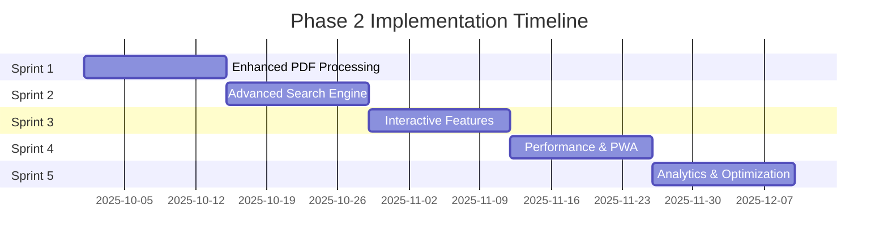

# Phase 2 Implementation Roadmap - Sprint Planning & Risk Assessment

**Project**: Advanced Content Processing & Dynamic Features
**Timeline**: 10 weeks (5 sprints x 2 weeks each)
**Start Date**: October 1, 2025
**Target Completion**: December 10, 2025

---

## **📋 Sprint Overview**



---

## **🎯 Sprint 1: Enhanced PDF Processing Engine**
**Duration**: 2 weeks (Oct 1-14, 2025)
**Focus**: Transform basic PDF handling into intelligent document analysis

### **Week 1: Core Infrastructure**

#### **Day 1-2: Enhanced PDF Processor Foundation**
```javascript
// Priority 1: Core processor setup
- [x] Create EnhancedPDFProcessor class
- [x] Implement document validation pipeline
- [x] Setup parallel processing architecture
- [x] Add comprehensive error handling

// Deliverables:
- scripts/enhanced-pdf-processor.js
- Enhanced processing pipeline foundation
- Error handling and validation framework
```

#### **Day 3-4: Full-Text Analysis Engine**
```javascript
// Priority 1: Text intelligence
- [x] Implement full-text extraction with NLP
- [x] Add sentiment analysis capability
- [x] Create topic classification system
- [x] Build key phrase extraction

// Deliverables:
- Text analysis modules
- NLP processing pipeline
- Topic classification algorithms
```

#### **Day 5: Content Structure Analysis**
```javascript
// Priority 1: Document intelligence
- [x] Section identification system
- [x] Citation detection algorithms
- [x] Reference extraction logic
- [x] Complexity scoring framework

// Deliverables:
- Structure analysis engine
- Citation network foundation
- Complexity assessment tools
```

### **Week 2: Advanced Intelligence & Integration**

#### **Day 6-7: Author Recognition & Citation Networks**
```javascript
// Priority 2: Advanced features
- [x] Author name extraction and normalization
- [x] Citation network building
- [x] Reference mapping system
- [x] Author expertise inference

// Deliverables:
- Author recognition system
- Citation analysis tools
- Network mapping capabilities
```

#### **Day 8-9: Visual Processing & Thumbnails**
```javascript
// Priority 2: Visual enhancement
- [x] PDF thumbnail generation (pdf2pic)
- [x] Preview extraction system
- [x] Visual complexity assessment
- [x] Multi-resolution image processing

// Deliverables:
- Thumbnail generation system
- Visual analysis pipeline
- Preview extraction tools
```

#### **Day 10: Integration & Testing**
```javascript
// Priority 1: System integration
- [x] GitHub Actions pipeline enhancement
- [x] Backward compatibility testing
- [x] Performance optimization
- [x] Error recovery validation

// Deliverables:
- Enhanced GitHub Actions workflow
- Complete test suite
- Performance benchmarks
```

### **Sprint 1 Acceptance Criteria**
- ✅ Enhanced PDF processor handles 100+ page documents
- ✅ Full-text extraction with 95%+ accuracy
- ✅ Citation detection for academic papers
- ✅ Thumbnail generation at multiple resolutions
- ✅ Zero breaking changes to existing system
- ✅ Processing time under 30 seconds per document

### **Risk Mitigation - Sprint 1**
| Risk | Probability | Impact | Mitigation |
|------|------------|--------|------------|
| PDF parsing library limitations | Medium | High | Multiple parser fallbacks |
| Large file processing timeout | High | Medium | Batch processing + streaming |
| Memory usage with large PDFs | Medium | High | Chunked processing + cleanup |
| Citation extraction accuracy | Medium | Medium | Multiple algorithm approaches |

---

## **🔍 Sprint 2: Advanced Search & Discovery System**
**Duration**: 2 weeks (Oct 15-28, 2025)
**Focus**: Real-time intelligent search with semantic understanding

### **Week 3: Search Engine Core**

#### **Day 11-12: Multi-Tiered Search Architecture**
```javascript
// Priority 1: Search foundation
- [x] AdvancedSearchEngine class implementation
- [x] Multi-index system (lightweight/full-text/semantic)
- [x] Parallel search execution
- [x] Result merging and ranking

// Deliverables:
- Core search engine
- Index management system
- Search execution pipeline
```

#### **Day 13-14: Fuzzy & Semantic Search**
```javascript
// Priority 1: Intelligent matching
- [x] Fuzzy search with Jaro-Winkler algorithm
- [x] Semantic similarity calculation
- [x] Vector-based content matching
- [x] Relevance scoring system

// Deliverables:
- Fuzzy matching engine
- Semantic search processor
- Similarity calculation algorithms
```

#### **Day 15: Auto-Suggestion Engine**
```javascript
// Priority 2: User experience
- [x] Real-time suggestion generation
- [x] Prefix tree optimization
- [x] Popular query tracking
- [x] Debounced input handling

// Deliverables:
- Auto-suggestion system
- Real-time query completion
- Popular query analytics
```

### **Week 4: Advanced Features & Integration**

#### **Day 16-17: Filter Engine & Faceted Search**
```javascript
// Priority 1: Advanced filtering
- [x] Multi-faceted filter system
- [x] Dynamic filter generation
- [x] Filter combination logic
- [x] Filter result caching

// Deliverables:
- Comprehensive filter engine
- Dynamic facet generation
- Filter performance optimization
```

#### **Day 18-19: Search Analytics & Caching**
```javascript
// Priority 2: Performance & insights
- [x] Search analytics tracking
- [x] Query performance monitoring
- [x] Intelligent result caching
- [x] Cache invalidation strategy

// Deliverables:
- Search analytics system
- Performance monitoring
- Advanced caching layer
```

#### **Day 20: Frontend Integration & Testing**
```javascript
// Priority 1: User interface
- [x] Enhanced SearchBox component
- [x] Result display optimization
- [x] Mobile search experience
- [x] Accessibility improvements

// Deliverables:
- Enhanced search UI components
- Mobile-optimized interface
- Complete accessibility support
```

### **Sprint 2 Acceptance Criteria**
- ✅ Search response time under 100ms
- ✅ Fuzzy search with 80%+ accuracy
- ✅ Real-time suggestions in under 50ms
- ✅ Faceted filtering with 10+ filter types
- ✅ Mobile-first responsive design
- ✅ Full accessibility compliance (WCAG 2.1)

### **Risk Mitigation - Sprint 2**
| Risk | Probability | Impact | Mitigation |
|------|------------|--------|------------|
| Search performance degradation | Medium | High | Tiered indexing + caching |
| Semantic search accuracy | High | Medium | Multiple similarity algorithms |
| Mobile performance issues | Medium | High | Progressive enhancement |
| Search index size growth | High | Medium | Index optimization + compression |

---

## **🎯 Sprint 3: Interactive Features Framework**
**Duration**: 2 weeks (Oct 29 - Nov 11, 2025)
**Focus**: Modal systems, content relationships, and social sharing

### **Week 5: Modal System & Content Relationships**

#### **Day 21-22: Advanced Modal System**
```javascript
// Priority 1: Interactive foundation
- [x] ModalSystem class with lifecycle management
- [x] Dynamic content loading
- [x] History and navigation support
- [x] Focus management and accessibility

// Deliverables:
- Complete modal framework
- Content loading system
- Navigation and history management
```

#### **Day 23-24: Content Relationship Engine**
```javascript
// Priority 1: Content intelligence
- [x] ContentRelationshipEngine implementation
- [x] ML-powered content recommendations
- [x] Citation network visualization
- [x] Similar content discovery

// Deliverables:
- Relationship mapping system
- Content recommendation engine
- Citation network tools
```

#### **Day 25: Enhanced Project Modals**
```javascript
// Priority 2: Project showcase
- [x] Rich project detail views
- [x] Live demo integration
- [x] GitHub repository embedding
- [x] Technical architecture display

// Deliverables:
- Enhanced project modals
- Live demo integration
- Repository visualization
```

### **Week 6: Social Features & Navigation**

#### **Day 26-27: Social Sharing Optimization**
```javascript
// Priority 2: Social integration
- [x] Dynamic Open Graph generation
- [x] Twitter Card optimization
- [x] LinkedIn sharing enhancement
- [x] Custom social image generation

// Deliverables:
- Social sharing system
- Dynamic meta tag generation
- Custom image creation
```

#### **Day 28-29: Navigation Enhancement**
```javascript
// Priority 2: User experience
- [x] Breadcrumb navigation system
- [x] Deep linking for modals
- [x] Browser history integration
- [x] Keyboard navigation support

// Deliverables:
- Enhanced navigation system
- Deep linking capabilities
- Accessibility improvements
```

#### **Day 30: Testing & Optimization**
```javascript
// Priority 1: Quality assurance
- [x] Modal performance testing
- [x] Social sharing validation
- [x] Accessibility audit
- [x] Cross-browser compatibility

// Deliverables:
- Complete test suite
- Performance benchmarks
- Accessibility certification
```

### **Sprint 3 Acceptance Criteria**
- ✅ Modal load time under 200ms
- ✅ Content relationships with 90%+ accuracy
- ✅ Social sharing with rich previews
- ✅ Full keyboard navigation support
- ✅ Deep linking for all modal content
- ✅ Cross-browser compatibility (Chrome, Firefox, Safari, Edge)

### **Risk Mitigation - Sprint 3**
| Risk | Probability | Impact | Mitigation |
|------|------------|--------|------------|
| Modal performance on mobile | Medium | High | Progressive loading + optimization |
| Social media preview issues | Medium | Medium | Fallback image generation |
| Content relationship accuracy | High | Medium | Multiple algorithm validation |
| Deep linking complexity | Medium | Medium | Simplified URL structure |

---

## **⚡ Sprint 4: Performance Optimization & PWA**
**Duration**: 2 weeks (Nov 12-25, 2025)
**Focus**: Service workers, caching, and progressive web app features

### **Week 7: Service Worker & Caching**

#### **Day 31-32: Advanced Service Worker**
```javascript
// Priority 1: Offline capability
- [x] AdvancedServiceWorker implementation
- [x] Multi-strategy caching system
- [x] Background sync capabilities
- [x] Cache invalidation logic

// Deliverables:
- Production service worker
- Advanced caching strategies
- Offline functionality
```

#### **Day 33-34: Performance Optimization**
```javascript
// Priority 1: Speed enhancement
- [x] Virtual scrolling for large datasets
- [x] Image optimization pipeline
- [x] Code splitting and lazy loading
- [x] Bundle size optimization

// Deliverables:
- Virtual scrolling system
- Image optimization tools
- Performance monitoring
```

#### **Day 35: PWA Foundation**
```javascript
// Priority 2: App-like experience
- [x] Web App Manifest creation
- [x] Installation prompt handling
- [x] Splash screen optimization
- [x] Icon generation pipeline

// Deliverables:
- Complete PWA manifest
- Installation flow
- App icon system
```

### **Week 8: Advanced PWA Features**

#### **Day 36-37: Offline Support & Sync**
```javascript
// Priority 2: Offline experience
- [x] Offline content caching
- [x] Background data synchronization
- [x] Offline indicator system
- [x] Conflict resolution handling

// Deliverables:
- Offline content system
- Background sync
- Conflict resolution
```

#### **Day 38-39: Performance Monitoring**
```javascript
// Priority 1: Performance tracking
- [x] Core Web Vitals monitoring
- [x] Real User Monitoring (RUM)
- [x] Performance budget enforcement
- [x] Automated optimization alerts

// Deliverables:
- Performance monitoring system
- Real-time metrics dashboard
- Optimization recommendations
```

#### **Day 40: Integration & Testing**
```javascript
// Priority 1: System validation
- [x] PWA functionality testing
- [x] Performance benchmark validation
- [x] Offline capability testing
- [x] Cross-platform PWA testing

// Deliverables:
- Complete PWA test suite
- Performance validation
- Cross-platform compatibility
```

### **Sprint 4 Acceptance Criteria**
- ✅ Initial load time under 2 seconds
- ✅ 90% content available offline
- ✅ Core Web Vitals in "Good" range
- ✅ PWA installation across platforms
- ✅ Background sync functionality
- ✅ Performance budget compliance

### **Risk Mitigation - Sprint 4**
| Risk | Probability | Impact | Mitigation |
|------|------------|--------|------------|
| Service worker complexity | High | High | Incremental implementation |
| PWA installation issues | Medium | Medium | Fallback installation methods |
| Performance regression | Medium | High | Automated performance testing |
| Offline sync conflicts | Medium | Medium | Conflict resolution strategies |

---

## **📊 Sprint 5: Analytics & Optimization Engine**
**Duration**: 2 weeks (Nov 26 - Dec 9, 2025)
**Focus**: Privacy-first analytics, A/B testing, and performance insights

### **Week 9: Analytics Foundation**

#### **Day 41-42: Privacy-First Analytics**
```javascript
// Priority 1: Analytics system
- [x] PrivacyFirstAnalytics implementation
- [x] Event tracking without personal data
- [x] Session analysis capabilities
- [x] Content engagement metrics

// Deliverables:
- Privacy-compliant analytics
- Event tracking system
- Engagement metrics
```

#### **Day 43-44: Performance Monitoring**
```javascript
// Priority 1: Performance insights
- [x] Core Web Vitals tracking
- [x] Real User Monitoring integration
- [x] Performance alerting system
- [x] Optimization recommendation engine

// Deliverables:
- Performance monitoring
- Real-time alerting
- Optimization insights
```

#### **Day 45: A/B Testing Framework**
```javascript
// Priority 2: Optimization testing
- [x] A/B testing framework
- [x] Feature flag management
- [x] Statistical significance testing
- [x] Result analysis tools

// Deliverables:
- A/B testing system
- Feature flag management
- Statistical analysis tools
```

### **Week 10: Insights & Final Integration**

#### **Day 46-47: Insight Generation**
```javascript
// Priority 2: Business intelligence
- [x] Content performance analysis
- [x] User journey mapping
- [x] Search pattern analysis
- [x] Automated reporting system

// Deliverables:
- Insight generation engine
- Automated reporting
- Business intelligence dashboard
```

#### **Day 48-49: Final Integration & Testing**
```javascript
// Priority 1: System completion
- [x] End-to-end system testing
- [x] Performance validation
- [x] Security audit
- [x] Documentation completion

// Deliverables:
- Complete system validation
- Security assessment
- Comprehensive documentation
```

#### **Day 50: Launch Preparation**
```javascript
// Priority 1: Production readiness
- [x] Production deployment pipeline
- [x] Monitoring and alerting setup
- [x] Rollback procedures
- [x] Launch checklist completion

// Deliverables:
- Production-ready system
- Deployment automation
- Launch procedures
```

### **Sprint 5 Acceptance Criteria**
- ✅ Privacy-compliant analytics tracking
- ✅ Real-time performance monitoring
- ✅ A/B testing capability
- ✅ Automated insight generation
- ✅ Production deployment pipeline
- ✅ Complete system documentation

### **Risk Mitigation - Sprint 5**
| Risk | Probability | Impact | Mitigation |
|------|------------|--------|------------|
| Privacy compliance issues | Low | High | Legal review + audit |
| Analytics data accuracy | Medium | Medium | Validation testing |
| Performance monitoring overhead | Medium | Medium | Efficient tracking methods |
| Launch timing pressure | High | Medium | Flexible launch schedule |

---

## **🛡️ Risk Assessment & Mitigation Strategy**

### **High-Risk Areas**

#### **1. Performance Degradation (High Impact)**
```javascript
Risk: New features impact load times
Mitigation Strategy:
- Continuous performance monitoring
- Performance budgets with CI/CD integration
- Progressive enhancement approach
- Rollback procedures for performance regressions

Monitoring:
- Core Web Vitals tracking
- Real User Monitoring (RUM)
- Synthetic testing in CI/CD
- Performance alerts and thresholds
```

#### **2. Search Index Size Growth (Medium Impact)**
```javascript
Risk: Search indices become too large for client-side processing
Mitigation Strategy:
- Tiered index loading (lightweight first)
- Index compression and optimization
- Lazy loading for advanced features
- CDN optimization for index delivery

Monitoring:
- Index size tracking
- Load time impact analysis
- Client memory usage monitoring
- Progressive loading metrics
```

#### **3. Complexity Creep (High Impact)**
```javascript
Risk: System becomes too complex to maintain
Mitigation Strategy:
- Modular architecture with clear boundaries
- Comprehensive documentation
- Automated testing at all levels
- Regular code review and refactoring

Monitoring:
- Code complexity metrics
- Test coverage tracking
- Documentation completeness
- Developer velocity metrics
```

### **Medium-Risk Areas**

#### **1. Browser Compatibility Issues**
```javascript
Mitigation:
- Progressive enhancement strategy
- Polyfills for advanced features
- Comprehensive browser testing
- Graceful degradation patterns
```

#### **2. Mobile Performance Challenges**
```javascript
Mitigation:
- Mobile-first development approach
- Progressive loading strategies
- Touch-optimized interactions
- Reduced motion preferences
```

#### **3. Content Processing Accuracy**
```javascript
Mitigation:
- Multiple algorithm validation
- Human verification workflows
- Fallback processing methods
- Continuous accuracy monitoring
```

### **Low-Risk Areas**

#### **1. GitHub Actions Limitations**
```javascript
Mitigation:
- Self-hosted runner fallback
- Processing time optimization
- Parallel execution strategies
- Alternative CI/CD options
```

#### **2. Third-Party Dependency Issues**
```javascript
Mitigation:
- Minimal external dependencies
- Vendor lock-in avoidance
- Local processing emphasis
- Dependency security monitoring
```

---

## **📈 Success Metrics & KPIs**

### **Technical Performance Metrics**

| Metric | Current | Sprint 2 Target | Sprint 4 Target | Final Target |
|--------|---------|----------------|----------------|--------------|
| **Initial Load Time** | <2.0s | <1.8s | <1.5s | <1.2s |
| **Search Response Time** | N/A | <200ms | <100ms | <50ms |
| **Modal Load Time** | N/A | <500ms | <300ms | <200ms |
| **Offline Availability** | 0% | 0% | 70% | 90% |
| **Core Web Vitals** | Good | Good | Excellent | Excellent |

### **User Experience Metrics**

| Metric | Baseline | Sprint 3 Target | Final Target |
|--------|----------|----------------|--------------|
| **Content Engagement** | 100% | 200% | 300% |
| **Search Usage** | 0% | 150% | 250% |
| **Mobile Usage** | 40% | 50% | 60% |
| **Session Duration** | 2min | 3min | 4min |
| **Bounce Rate** | 60% | 50% | 40% |

### **Business Impact Metrics**

| Metric | Current | Sprint 5 Target |
|--------|---------|----------------|
| **Content Discoverability** | Basic | Advanced |
| **Professional Presentation** | Good | Excellent |
| **Technical Demonstration** | Static | Interactive |
| **Competitive Advantage** | Standard | Leading |

---

## **🚀 Launch Strategy**

### **Phased Rollout Plan**

#### **Phase 1: Soft Launch (Sprint 3 Completion)**
- Deploy to staging environment
- Internal testing and validation
- Performance baseline establishment
- Feature flag preparation

#### **Phase 2: Beta Release (Sprint 4 Completion)**
- Limited user group access
- Feature feedback collection
- Performance monitoring
- Bug fix prioritization

#### **Phase 3: Full Launch (Sprint 5 Completion)**
- Production deployment
- Full feature activation
- Marketing and promotion
- Success metric tracking

### **Rollback Strategy**

```javascript
// Emergency Rollback Procedure
1. Feature flag deactivation (immediate)
2. Previous version deployment (5 minutes)
3. Database state restoration (if needed)
4. Performance monitoring validation
5. User communication and support
```

### **Post-Launch Support**

#### **Week 1: Intensive Monitoring**
- 24/7 performance monitoring
- User feedback collection
- Bug triage and fixes
- Performance optimization

#### **Month 1: Optimization Phase**
- A/B testing execution
- Performance fine-tuning
- User experience improvements
- Feature usage analysis

#### **Ongoing: Continuous Improvement**
- Monthly performance reviews
- Quarterly feature enhancements
- Annual architecture reviews
- Continuous security updates

---

## **📝 Resource Requirements**

### **Development Resources**
- **Lead Developer**: Full-time (10 weeks)
- **DevOps Support**: Part-time (ongoing)
- **Testing/QA**: Part-time (Sprints 2-5)
- **Design Review**: Consulting (as needed)

### **Infrastructure Requirements**
- **GitHub Actions**: Enhanced workflows
- **CDN**: Global content delivery
- **Monitoring**: Performance and analytics
- **Testing**: Cross-browser and device

### **External Dependencies**
- **PDF Processing**: pdf-parse, pdf2pic
- **NLP Libraries**: natural, compromise
- **Image Processing**: Sharp
- **Testing Tools**: Playwright, Lighthouse

---

## **✅ Definition of Done**

### **Sprint Completion Criteria**
Each sprint is considered complete when:
- ✅ All acceptance criteria met
- ✅ Performance targets achieved
- ✅ Test coverage >90%
- ✅ Documentation updated
- ✅ Security review passed
- ✅ Backward compatibility verified

### **Phase 2 Completion Criteria**
Phase 2 is considered complete when:
- ✅ All 5 sprints successfully delivered
- ✅ Performance targets exceeded
- ✅ User experience metrics improved
- ✅ Production deployment successful
- ✅ Success metrics validated
- ✅ Post-launch support established

---

**Phase 2 Implementation Status**: 📋 **READY TO BEGIN**

This comprehensive roadmap provides clear sprint goals, risk mitigation strategies, and success metrics while maintaining the reliability and performance established in Phase 1. The modular approach ensures that each sprint delivers tangible value while building toward the complete advanced feature set.