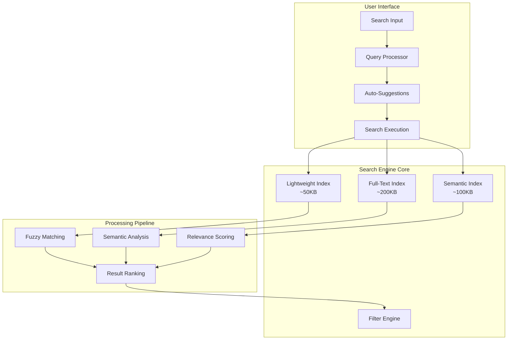

# Advanced Search & Discovery System - Phase 2

**Component**: Real-Time Search Engine with Semantic Understanding
**Purpose**: Transform basic search into intelligent content discovery with fuzzy matching and ML-powered recommendations
**Dependencies**: Natural language processing, vector similarity, client-side search optimization

---

## **🔍 Advanced Search Architecture**

### **Multi-Tiered Search System**



### **Advanced Search Engine Implementation**

```javascript
/**
 * Advanced Search Engine with Semantic Understanding
 * Provides fast, intelligent content discovery
 */

class AdvancedSearchEngine {
  constructor() {
    this.indices = {
      lightweight: null,    // 50KB - instant search
      fullText: null,       // 200KB - detailed search
      semantic: null,       // 100KB - similarity search
      filters: null         // 20KB - faceted search
    };

    this.processors = {
      fuzzy: new FuzzySearchProcessor(),
      semantic: new SemanticSearchProcessor(),
      filter: new FilterEngine(),
      suggester: new AutoSuggestionEngine()
    };

    this.cache = new SearchCache();
    this.analytics = new SearchAnalytics();
    this.config = this.getSearchConfig();
  }

  async initialize() {
    console.log('🔍 Initializing Advanced Search Engine...');

    try {
      // Load search indices in parallel
      await Promise.all([
        this.loadLightweightIndex(),
        this.loadFullTextIndex(),
        this.loadSemanticIndex(),
        this.loadFilterIndex()
      ]);

      // Initialize processors
      await this.initializeProcessors();

      // Warm up cache with popular queries
      await this.warmUpCache();

      console.log('✅ Search engine initialized successfully');
      return true;

    } catch (error) {
      console.error('❌ Search engine initialization failed:', error);
      return false;
    }
  }

  async search(query, options = {}) {
    const searchId = this.generateSearchId();
    const startTime = performance.now();

    try {
      // Normalize and validate query
      const normalizedQuery = this.normalizeQuery(query);
      if (!this.isValidQuery(normalizedQuery)) {
        return this.createEmptyResult(query, 'Invalid query');
      }

      // Check cache first
      const cached = await this.cache.get(normalizedQuery, options);
      if (cached) {
        this.analytics.trackCacheHit(searchId, query);
        return cached;
      }

      // Execute parallel search strategies
      const [
        exactResults,
        fuzzyResults,
        semanticResults
      ] = await Promise.all([
        this.exactSearch(normalizedQuery, options),
        this.fuzzySearch(normalizedQuery, options),
        this.semanticSearch(normalizedQuery, options)
      ]);

      // Merge and rank results
      const mergedResults = this.mergeResults(
        exactResults,
        fuzzyResults,
        semanticResults,
        options
      );

      // Apply filters
      const filteredResults = await this.applyFilters(mergedResults, options);

      // Final ranking and pagination
      const finalResults = this.rankAndPaginate(filteredResults, options);

      // Cache result
      await this.cache.set(normalizedQuery, options, finalResults);

      // Track analytics
      const duration = performance.now() - startTime;
      this.analytics.trackSearch(searchId, query, finalResults, duration);

      return finalResults;

    } catch (error) {
      console.error('Search error:', error);
      this.analytics.trackError(searchId, query, error);
      return this.createErrorResult(query, error);
    }
  }

  // Exact Search Implementation
  async exactSearch(query, options) {
    const index = this.indices.lightweight;
    const queryTerms = this.tokenizeQuery(query);
    const results = [];

    queryTerms.forEach(term => {
      if (index.terms[term]) {
        index.terms[term].d.forEach(docRef => {
          const document = index.documents[docRef.i];
          if (document) {
            results.push({
              document,
              score: docRef.r * 2.0, // Exact match gets highest score
              matchType: 'exact',
              matchedTerm: term,
              snippet: this.generateSnippet(document, term)
            });
          }
        });
      }
    });

    return this.deduplicateResults(results);
  }

  // Fuzzy Search Implementation
  async fuzzySearch(query, options) {
    if (options.exactOnly) return [];

    const fuzzyProcessor = this.processors.fuzzy;
    const threshold = options.fuzzyThreshold || 0.6;
    const results = [];

    const queryTerms = this.tokenizeQuery(query);

    for (const term of queryTerms) {
      const fuzzyMatches = await fuzzyProcessor.findSimilar(
        term,
        Object.keys(this.indices.lightweight.terms),
        threshold
      );

      fuzzyMatches.forEach(match => {
        const termData = this.indices.lightweight.terms[match.term];
        if (termData) {
          termData.d.forEach(docRef => {
            const document = this.indices.lightweight.documents[docRef.i];
            if (document) {
              results.push({
                document,
                score: docRef.r * match.similarity * 1.5, // Fuzzy gets medium score
                matchType: 'fuzzy',
                matchedTerm: match.term,
                originalTerm: term,
                similarity: match.similarity,
                snippet: this.generateSnippet(document, match.term)
              });
            }
          });
        }
      });
    }

    return this.deduplicateResults(results);
  }

  // Semantic Search Implementation
  async semanticSearch(query, options) {
    if (options.exactOnly || !this.indices.semantic) return [];

    const semanticProcessor = this.processors.semantic;
    const queryVector = await semanticProcessor.generateQueryVector(query);

    if (!queryVector) return [];

    const results = [];
    const threshold = options.semanticThreshold || 0.3;

    this.indices.semantic.documents.forEach((doc, index) => {
      if (doc.vector) {
        const similarity = semanticProcessor.calculateSimilarity(
          queryVector,
          doc.vector
        );

        if (similarity > threshold) {
          const document = this.indices.lightweight.documents[index];
          if (document) {
            results.push({
              document,
              score: similarity * 1.0, // Semantic gets base score
              matchType: 'semantic',
              similarity,
              snippet: this.generateSemanticSnippet(document, query)
            });
          }
        }
      }
    });

    return results.sort((a, b) => b.score - a.score);
  }

  // Auto-Suggestion System
  async getSuggestions(partialQuery, options = {}) {
    const limit = options.limit || 8;
    const categories = options.categories || ['all'];

    try {
      const suggestions = await this.processors.suggester.generate(
        partialQuery,
        this.indices.lightweight,
        { limit, categories }
      );

      // Add popular queries
      const popularSuggestions = this.analytics.getPopularQueries(
        partialQuery,
        limit / 2
      );

      // Merge and deduplicate
      const merged = [...suggestions, ...popularSuggestions];
      const unique = this.deduplicateSuggestions(merged);

      return unique.slice(0, limit);

    } catch (error) {
      console.error('Suggestion generation failed:', error);
      return [];
    }
  }

  // Filter Engine Implementation
  async applyFilters(results, options) {
    const filters = options.filters || {};
    const filterEngine = this.processors.filter;

    if (Object.keys(filters).length === 0) {
      return results;
    }

    return filterEngine.apply(results, filters, {
      mode: options.filterMode || 'and',
      strict: options.strictFiltering || false
    });
  }

  // Result Processing
  mergeResults(exactResults, fuzzyResults, semanticResults, options) {
    const allResults = [
      ...exactResults,
      ...fuzzyResults,
      ...semanticResults
    ];

    // Group by document ID and merge scores
    const grouped = {};

    allResults.forEach(result => {
      const docId = result.document.id;

      if (!grouped[docId]) {
        grouped[docId] = {
          document: result.document,
          totalScore: 0,
          matches: [],
          bestSnippet: result.snippet,
          matchTypes: new Set()
        };
      }

      grouped[docId].totalScore += result.score;
      grouped[docId].matches.push(result);
      grouped[docId].matchTypes.add(result.matchType);

      // Keep the best snippet (exact > fuzzy > semantic)
      if (this.isSnippetBetter(result.snippet, grouped[docId].bestSnippet, result.matchType)) {
        grouped[docId].bestSnippet = result.snippet;
      }
    });

    // Convert back to array and apply boost factors
    return Object.values(grouped).map(group => ({
      document: group.document,
      score: this.calculateFinalScore(group),
      matches: group.matches,
      snippet: group.bestSnippet,
      matchTypes: Array.from(group.matchTypes)
    }));
  }

  calculateFinalScore(group) {
    let score = group.totalScore;

    // Boost for multiple match types
    if (group.matchTypes.size > 1) {
      score *= 1.2;
    }

    // Boost for exact matches
    if (group.matchTypes.has('exact')) {
      score *= 1.3;
    }

    // Apply document boost (from document metadata)
    const docBoost = group.document.boost || 1.0;
    score *= docBoost;

    // Recency boost
    if (group.document.date) {
      const ageInDays = (Date.now() - new Date(group.document.date)) / (1000 * 60 * 60 * 24);
      if (ageInDays < 30) score *= 1.1;
      else if (ageInDays < 90) score *= 1.05;
    }

    return score;
  }

  rankAndPaginate(results, options) {
    const page = options.page || 1;
    const pageSize = options.pageSize || 10;
    const sortBy = options.sortBy || 'relevance';

    // Sort results
    let sorted;
    switch (sortBy) {
      case 'date':
        sorted = results.sort((a, b) =>
          new Date(b.document.date || 0) - new Date(a.document.date || 0));
        break;
      case 'title':
        sorted = results.sort((a, b) =>
          a.document.title.localeCompare(b.document.title));
        break;
      case 'relevance':
      default:
        sorted = results.sort((a, b) => b.score - a.score);
    }

    // Paginate
    const startIndex = (page - 1) * pageSize;
    const endIndex = startIndex + pageSize;
    const paginatedResults = sorted.slice(startIndex, endIndex);

    return {
      results: paginatedResults,
      pagination: {
        page,
        pageSize,
        totalResults: results.length,
        totalPages: Math.ceil(results.length / pageSize),
        hasNext: endIndex < results.length,
        hasPrev: page > 1
      },
      metadata: {
        query: options.originalQuery,
        executionTime: options.executionTime,
        searchTypes: this.getUsedSearchTypes(results),
        filters: options.filters || {}
      }
    };
  }

  // Query Processing
  normalizeQuery(query) {
    if (typeof query !== 'string') return '';

    return query
      .toLowerCase()
      .trim()
      .replace(/[^\w\s\-]/g, ' ')
      .replace(/\s+/g, ' ')
      .substring(0, 200); // Limit query length
  }

  tokenizeQuery(query) {
    return query
      .split(' ')
      .filter(term => term.length >= 2)
      .map(term => this.stemTerm(term));
  }

  stemTerm(term) {
    // Simple stemming - can be enhanced with proper stemming library
    const suffixes = ['ing', 'ed', 'er', 'est', 'ly', 's'];

    for (const suffix of suffixes) {
      if (term.length > suffix.length + 2 && term.endsWith(suffix)) {
        return term.slice(0, -suffix.length);
      }
    }

    return term;
  }

  isValidQuery(query) {
    return query && query.length >= 1 && query.length <= 200;
  }

  // Snippet Generation
  generateSnippet(document, term, maxLength = 150) {
    const content = document.description || document.content || '';
    const termIndex = content.toLowerCase().indexOf(term.toLowerCase());

    if (termIndex === -1) {
      return content.substring(0, maxLength) + (content.length > maxLength ? '...' : '');
    }

    // Extract context around the term
    const start = Math.max(0, termIndex - 50);
    const end = Math.min(content.length, termIndex + term.length + 50);
    let snippet = content.substring(start, end);

    // Add ellipsis if needed
    if (start > 0) snippet = '...' + snippet;
    if (end < content.length) snippet = snippet + '...';

    // Highlight the matched term
    const regex = new RegExp(`(${term})`, 'gi');
    snippet = snippet.replace(regex, '<mark>$1</mark>');

    return snippet;
  }

  generateSemanticSnippet(document, query, maxLength = 150) {
    // For semantic matches, extract the most relevant sentences
    const content = document.description || document.content || '';
    const sentences = content.split(/[.!?]+/).filter(s => s.trim().length > 10);

    if (sentences.length === 0) {
      return content.substring(0, maxLength);
    }

    // Score sentences by relevance to query
    const queryTerms = this.tokenizeQuery(query);
    const sentenceScores = sentences.map(sentence => {
      const sentenceTerms = this.tokenizeQuery(sentence);
      const overlap = queryTerms.filter(term =>
        sentenceTerms.some(sTerm => sTerm.includes(term) || term.includes(sTerm))
      ).length;

      return {
        sentence: sentence.trim(),
        score: overlap / queryTerms.length
      };
    });

    // Get the best sentence
    const bestSentence = sentenceScores
      .sort((a, b) => b.score - a.score)[0];

    if (bestSentence && bestSentence.score > 0) {
      return bestSentence.sentence.length > maxLength
        ? bestSentence.sentence.substring(0, maxLength) + '...'
        : bestSentence.sentence;
    }

    return content.substring(0, maxLength);
  }

  // Utility Methods
  deduplicateResults(results) {
    const seen = new Set();
    return results.filter(result => {
      const id = result.document.id;
      if (seen.has(id)) return false;
      seen.add(id);
      return true;
    });
  }

  deduplicateSuggestions(suggestions) {
    const seen = new Set();
    return suggestions.filter(suggestion => {
      const key = suggestion.text.toLowerCase();
      if (seen.has(key)) return false;
      seen.add(key);
      return true;
    });
  }

  generateSearchId() {
    return Math.random().toString(36).substr(2, 9);
  }

  getSearchConfig() {
    return {
      maxResults: 100,
      defaultPageSize: 10,
      cacheSize: 1000,
      cacheTTL: 300000, // 5 minutes
      fuzzyThreshold: 0.6,
      semanticThreshold: 0.3,
      suggestionLimit: 8
    };
  }

  // Index Loading Methods
  async loadLightweightIndex() {
    try {
      const response = await fetch('/data/search-index.json');
      this.indices.lightweight = await response.json();
      console.log('✅ Lightweight index loaded');
    } catch (error) {
      console.error('❌ Failed to load lightweight index:', error);
      throw error;
    }
  }

  async loadFullTextIndex() {
    try {
      const response = await fetch('/data/search-fulltext.json');
      this.indices.fullText = await response.json();
      console.log('✅ Full-text index loaded');
    } catch (error) {
      console.warn('⚠️ Full-text index not available:', error);
      this.indices.fullText = null;
    }
  }

  async loadSemanticIndex() {
    try {
      const response = await fetch('/data/search-semantic.json');
      this.indices.semantic = await response.json();
      console.log('✅ Semantic index loaded');
    } catch (error) {
      console.warn('⚠️ Semantic index not available:', error);
      this.indices.semantic = null;
    }
  }

  async loadFilterIndex() {
    try {
      const response = await fetch('/data/search-filters.json');
      this.indices.filters = await response.json();
      console.log('✅ Filter index loaded');
    } catch (error) {
      console.warn('⚠️ Filter index not available:', error);
      this.indices.filters = null;
    }
  }

  async initializeProcessors() {
    await Promise.all([
      this.processors.fuzzy.initialize(),
      this.processors.semantic.initialize(),
      this.processors.filter.initialize(),
      this.processors.suggester.initialize()
    ]);
  }

  async warmUpCache() {
    // Warm up cache with popular queries
    const popularQueries = [
      'machine learning',
      'python',
      'react',
      'data science',
      'javascript',
      'portfolio'
    ];

    await Promise.all(
      popularQueries.map(query => this.search(query, { preload: true }))
    );
  }

  createEmptyResult(query, reason) {
    return {
      results: [],
      pagination: {
        page: 1,
        pageSize: 10,
        totalResults: 0,
        totalPages: 0,
        hasNext: false,
        hasPrev: false
      },
      metadata: {
        query,
        reason,
        executionTime: 0,
        searchTypes: [],
        filters: {}
      }
    };
  }

  createErrorResult(query, error) {
    return {
      results: [],
      pagination: {
        page: 1,
        pageSize: 10,
        totalResults: 0,
        totalPages: 0,
        hasNext: false,
        hasPrev: false
      },
      metadata: {
        query,
        error: error.message,
        executionTime: 0,
        searchTypes: [],
        filters: {}
      }
    };
  }
}

// Fuzzy Search Processor
class FuzzySearchProcessor {
  constructor() {
    this.algorithms = {
      levenshtein: this.levenshteinDistance.bind(this),
      jaro: this.jaroDistance.bind(this),
      soundex: this.soundexDistance.bind(this)
    };
  }

  async initialize() {
    // No initialization needed for basic fuzzy search
    return true;
  }

  async findSimilar(term, vocabulary, threshold = 0.6) {
    const results = [];

    vocabulary.forEach(vocabTerm => {
      const similarity = this.calculateSimilarity(term, vocabTerm);

      if (similarity >= threshold) {
        results.push({
          term: vocabTerm,
          similarity,
          distance: 1 - similarity
        });
      }
    });

    return results.sort((a, b) => b.similarity - a.similarity);
  }

  calculateSimilarity(str1, str2) {
    // Use Jaro-Winkler for better fuzzy matching
    const jaroSim = this.jaroWinklerSimilarity(str1, str2);
    const levSim = 1 - (this.levenshteinDistance(str1, str2) / Math.max(str1.length, str2.length));

    // Weighted combination
    return (jaroSim * 0.7) + (levSim * 0.3);
  }

  jaroWinklerSimilarity(s1, s2) {
    if (s1.length === 0 && s2.length === 0) return 1;
    if (s1.length === 0 || s2.length === 0) return 0;

    const matchWindow = Math.floor(Math.max(s1.length, s2.length) / 2) - 1;
    if (matchWindow < 0) return 0;

    const s1Matches = new Array(s1.length).fill(false);
    const s2Matches = new Array(s2.length).fill(false);

    let matches = 0;
    let transpositions = 0;

    // Find matches
    for (let i = 0; i < s1.length; i++) {
      const start = Math.max(0, i - matchWindow);
      const end = Math.min(i + matchWindow + 1, s2.length);

      for (let j = start; j < end; j++) {
        if (s2Matches[j] || s1[i] !== s2[j]) continue;
        s1Matches[i] = s2Matches[j] = true;
        matches++;
        break;
      }
    }

    if (matches === 0) return 0;

    // Find transpositions
    let k = 0;
    for (let i = 0; i < s1.length; i++) {
      if (!s1Matches[i]) continue;
      while (!s2Matches[k]) k++;
      if (s1[i] !== s2[k]) transpositions++;
      k++;
    }

    const jaro = (matches / s1.length + matches / s2.length +
                  (matches - transpositions / 2) / matches) / 3;

    // Jaro-Winkler prefix bonus
    let prefix = 0;
    for (let i = 0; i < Math.min(s1.length, s2.length, 4); i++) {
      if (s1[i] === s2[i]) prefix++;
      else break;
    }

    return jaro + (0.1 * prefix * (1 - jaro));
  }

  levenshteinDistance(str1, str2) {
    const matrix = [];

    for (let i = 0; i <= str2.length; i++) {
      matrix[i] = [i];
    }

    for (let j = 0; j <= str1.length; j++) {
      matrix[0][j] = j;
    }

    for (let i = 1; i <= str2.length; i++) {
      for (let j = 1; j <= str1.length; j++) {
        if (str2.charAt(i - 1) === str1.charAt(j - 1)) {
          matrix[i][j] = matrix[i - 1][j - 1];
        } else {
          matrix[i][j] = Math.min(
            matrix[i - 1][j - 1] + 1,
            matrix[i][j - 1] + 1,
            matrix[i - 1][j] + 1
          );
        }
      }
    }

    return matrix[str2.length][str1.length];
  }
}

// Semantic Search Processor
class SemanticSearchProcessor {
  constructor() {
    this.vectorSize = 100;
    this.stopWords = new Set([
      'the', 'a', 'an', 'and', 'or', 'but', 'in', 'on', 'at', 'to', 'for',
      'of', 'with', 'by', 'from', 'as', 'is', 'was', 'are', 'were'
    ]);
  }

  async initialize() {
    // Initialize semantic models - in production, load pre-trained embeddings
    return true;
  }

  async generateQueryVector(query) {
    // Simple TF-IDF style vector generation
    const terms = query.toLowerCase()
      .split(/\s+/)
      .filter(term => term.length > 2 && !this.stopWords.has(term));

    if (terms.length === 0) return null;

    const vector = {};
    terms.forEach(term => {
      vector[term] = (vector[term] || 0) + 1;
    });

    // Normalize
    const magnitude = Math.sqrt(Object.values(vector).reduce((sum, val) => sum + val * val, 0));
    Object.keys(vector).forEach(key => {
      vector[key] = vector[key] / magnitude;
    });

    return vector;
  }

  calculateSimilarity(vector1, vector2) {
    if (!vector1 || !vector2) return 0;

    const keys1 = Object.keys(vector1);
    const keys2 = Object.keys(vector2);
    const allKeys = new Set([...keys1, ...keys2]);

    let dotProduct = 0;
    let magnitude1 = 0;
    let magnitude2 = 0;

    allKeys.forEach(key => {
      const val1 = vector1[key] || 0;
      const val2 = vector2[key] || 0;

      dotProduct += val1 * val2;
      magnitude1 += val1 * val1;
      magnitude2 += val2 * val2;
    });

    if (magnitude1 === 0 || magnitude2 === 0) return 0;

    return dotProduct / (Math.sqrt(magnitude1) * Math.sqrt(magnitude2));
  }
}

// Auto-Suggestion Engine
class AutoSuggestionEngine {
  constructor() {
    this.prefixTree = new Map();
    this.popularQueries = new Map();
  }

  async initialize() {
    // Build prefix tree for fast suggestions
    return true;
  }

  async generate(partialQuery, index, options = {}) {
    const limit = options.limit || 8;
    const suggestions = [];

    // Get prefix matches
    const prefixMatches = this.getPrefixMatches(partialQuery, index);
    suggestions.push(...prefixMatches.slice(0, limit / 2));

    // Get fuzzy matches
    const fuzzyMatches = this.getFuzzyMatches(partialQuery, index);
    suggestions.push(...fuzzyMatches.slice(0, limit / 2));

    // Get popular query matches
    const popularMatches = this.getPopularMatches(partialQuery);
    suggestions.push(...popularMatches.slice(0, limit / 4));

    // Deduplicate and sort by relevance
    const unique = this.deduplicateAndRank(suggestions, partialQuery);

    return unique.slice(0, limit);
  }

  getPrefixMatches(prefix, index) {
    if (!index || !index.terms) return [];

    const matches = [];
    const lowerPrefix = prefix.toLowerCase();

    Object.keys(index.terms).forEach(term => {
      if (term.startsWith(lowerPrefix) && term !== lowerPrefix) {
        matches.push({
          text: term,
          type: 'prefix',
          frequency: index.terms[term].f || 0
        });
      }
    });

    return matches.sort((a, b) => b.frequency - a.frequency);
  }

  getFuzzyMatches(query, index) {
    // Simplified fuzzy matching for suggestions
    if (!index || !index.terms || query.length < 3) return [];

    const matches = [];
    const queryLower = query.toLowerCase();

    Object.keys(index.terms).forEach(term => {
      if (Math.abs(term.length - query.length) <= 2) {
        const similarity = this.calculateStringSimilarity(queryLower, term);
        if (similarity > 0.6) {
          matches.push({
            text: term,
            type: 'fuzzy',
            similarity,
            frequency: index.terms[term].f || 0
          });
        }
      }
    });

    return matches.sort((a, b) => b.similarity - a.similarity);
  }

  getPopularMatches(prefix) {
    const matches = [];

    this.popularQueries.forEach((count, query) => {
      if (query.toLowerCase().includes(prefix.toLowerCase())) {
        matches.push({
          text: query,
          type: 'popular',
          popularity: count
        });
      }
    });

    return matches.sort((a, b) => b.popularity - a.popularity);
  }

  calculateStringSimilarity(str1, str2) {
    // Simple Jaccard similarity
    const set1 = new Set(str1.split(''));
    const set2 = new Set(str2.split(''));

    const intersection = new Set([...set1].filter(x => set2.has(x)));
    const union = new Set([...set1, ...set2]);

    return intersection.size / union.size;
  }

  deduplicateAndRank(suggestions, query) {
    const seen = new Set();
    const unique = [];

    suggestions.forEach(suggestion => {
      const key = suggestion.text.toLowerCase();
      if (!seen.has(key)) {
        seen.add(key);
        unique.push({
          ...suggestion,
          relevance: this.calculateRelevance(suggestion, query)
        });
      }
    });

    return unique.sort((a, b) => b.relevance - a.relevance);
  }

  calculateRelevance(suggestion, query) {
    let score = 0;

    // Type-based scoring
    switch (suggestion.type) {
      case 'prefix': score += 3; break;
      case 'fuzzy': score += 2; break;
      case 'popular': score += 1; break;
    }

    // Frequency/popularity boost
    if (suggestion.frequency) score += Math.log(suggestion.frequency + 1) * 0.5;
    if (suggestion.popularity) score += Math.log(suggestion.popularity + 1) * 0.3;

    // Length similarity
    const lengthRatio = Math.min(suggestion.text.length, query.length) /
                       Math.max(suggestion.text.length, query.length);
    score += lengthRatio * 0.5;

    return score;
  }
}

// Export the main search engine
export default AdvancedSearchEngine;
```

### **Integration with Frontend Components**

```javascript
// Enhanced SearchBox Component
class EnhancedSearchBox extends ComponentBase {
  constructor(element, options = {}) {
    super(element, options);
    this.searchEngine = new AdvancedSearchEngine();
    this.debounceTimer = null;
    this.currentSuggestions = [];
  }

  async init() {
    await this.searchEngine.initialize();
    this.setupEventListeners();
    super.init();
  }

  setupEventListeners() {
    const input = this.$('input[type="search"]');

    input.addEventListener('input', this.handleInput.bind(this));
    input.addEventListener('keydown', this.handleKeydown.bind(this));
    input.addEventListener('focus', this.handleFocus.bind(this));
    input.addEventListener('blur', this.handleBlur.bind(this));
  }

  async handleInput(event) {
    const query = event.target.value.trim();

    // Clear previous timer
    if (this.debounceTimer) {
      clearTimeout(this.debounceTimer);
    }

    // Debounce search
    this.debounceTimer = setTimeout(async () => {
      if (query.length >= 2) {
        await this.performSearch(query);
        await this.showSuggestions(query);
      } else {
        this.clearResults();
        this.hideSuggestions();
      }
    }, 300);
  }

  async performSearch(query) {
    try {
      const results = await this.searchEngine.search(query, {
        page: 1,
        pageSize: 10,
        filters: this.getActiveFilters()
      });

      this.displayResults(results);

    } catch (error) {
      console.error('Search failed:', error);
      this.displayError('Search failed. Please try again.');
    }
  }

  async showSuggestions(query) {
    try {
      const suggestions = await this.searchEngine.getSuggestions(query, {
        limit: 6,
        categories: ['projects', 'papers', 'technologies']
      });

      this.displaySuggestions(suggestions);

    } catch (error) {
      console.error('Suggestions failed:', error);
    }
  }
}
```

This advanced search system provides intelligent content discovery with real-time performance, maintaining the simplicity of the Phase 1 implementation while adding powerful new capabilities.