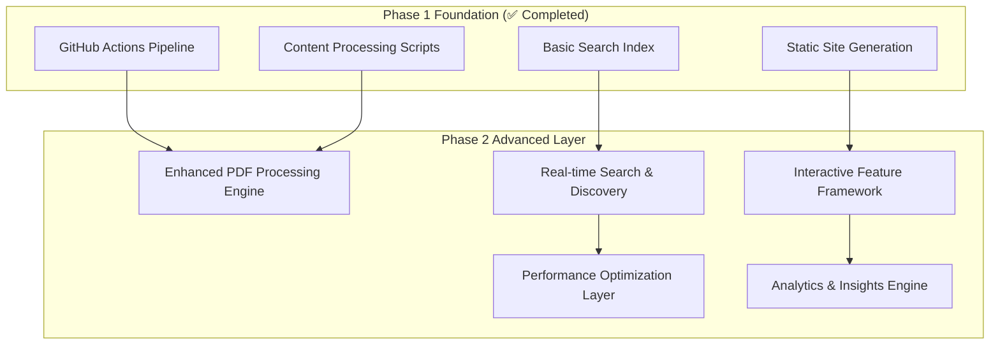
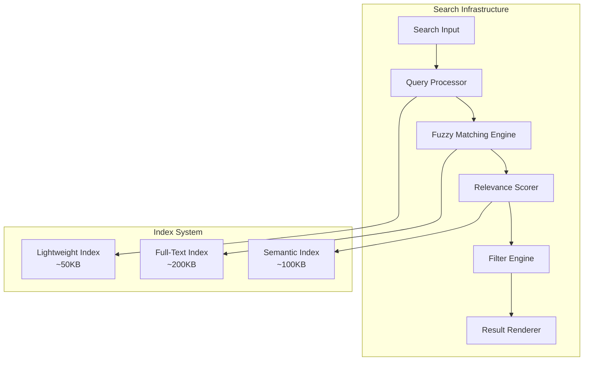
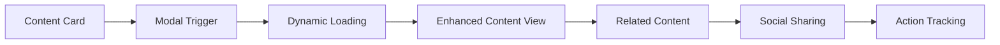
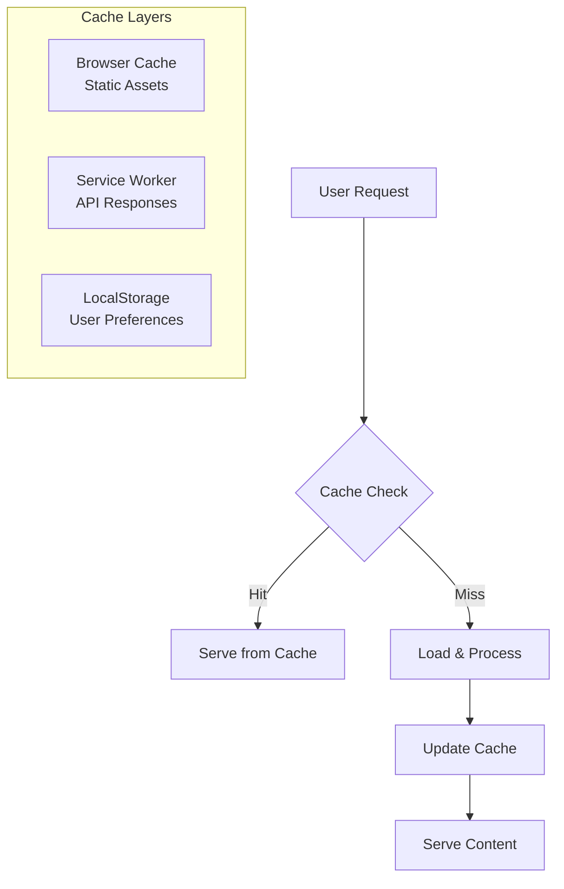
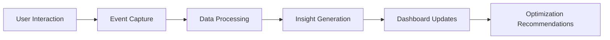
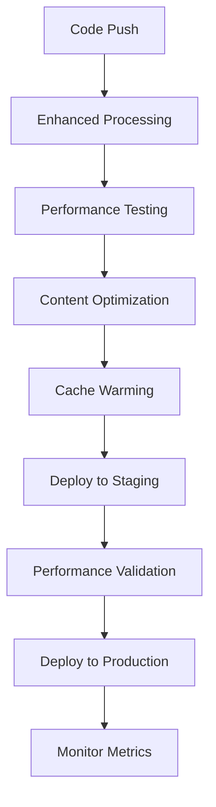

# Phase 2 Technical Architecture - Advanced Content Processing & Dynamic Features

**Implementation Date**: September 21, 2025
**Phase**: Advanced Features & Enhanced User Experience
**Status**: 📋 **DESIGN PHASE**

---

## **🏗️ Architecture Overview**

### **System Design Philosophy**
Building upon Phase 1's solid foundation with **zero-breaking changes**, Phase 2 introduces advanced capabilities through **progressive enhancement** and **modular extensions**.



### **Core Design Principles**
- **Backward Compatibility**: All Phase 1 functionality preserved
- **Progressive Enhancement**: Features work without JavaScript, enhanced with it
- **Performance First**: <2s initial load time maintained
- **Scalability Ready**: Architecture supports 10x content growth
- **Static Hosting Compatible**: GitHub Pages compliance maintained

---

## **📚 Enhanced PDF Processing Engine**

### **Advanced PDF Analysis Pipeline**


#### **Full-Text Extraction & Indexing**
```javascript
// Enhanced PDF Processing Architecture
class AdvancedPDFProcessor {
  constructor() {
    this.extractors = {
      text: new FullTextExtractor(),
      metadata: new MetadataExtractor(),
      citations: new CitationExtractor(),
      structure: new DocumentStructureAnalyzer()
    };
  }

  async processDocument(pdfPath) {
    const analysis = {
      fullText: await this.extractors.text.extract(pdfPath),
      metadata: await this.extractors.metadata.extract(pdfPath),
      citations: await this.extractors.citations.extract(pdfPath),
      structure: await this.extractors.structure.analyze(pdfPath),
      similarity: await this.calculateSimilarity(pdfPath),
      searchTerms: await this.generateAdvancedSearchTerms(pdfPath)
    };

    return this.createEnhancedDocument(analysis);
  }
}
```

#### **Advanced Metadata Extraction**
- **Author Detection**: Name entity recognition for multiple authors
- **Citation Network**: Reference extraction and cross-linking
- **Topic Classification**: ML-based subject categorization
- **Reading Time**: Accurate word count and reading estimates
- **Complexity Score**: Technical difficulty assessment

#### **Content Similarity Engine**
```javascript
class ContentSimilarityEngine {
  async calculateSimilarity(document, corpus) {
    const vectors = {
      tfidf: await this.generateTFIDFVector(document),
      semantic: await this.generateSemanticVector(document),
      structural: await this.analyzeStructure(document)
    };

    return this.findSimilarDocuments(vectors, corpus);
  }
}
```

#### **PDF Preview Generation**
- **Thumbnail Creation**: First page preview at multiple resolutions
- **Text Preview**: Clean text extraction with formatting preservation
- **Highlight Generation**: Key sentence extraction for previews
- **Mobile Optimization**: Responsive preview layouts

---

## **🔍 Dynamic Search & Discovery System**

### **Real-Time Search Architecture**



#### **Multi-Tiered Search System**
```javascript
class AdvancedSearchEngine {
  constructor() {
    this.indices = {
      lightweight: null,    // 50KB - instant search
      fullText: null,       // 200KB - detailed search
      semantic: null        // 100KB - similarity search
    };

    this.processors = {
      fuzzy: new FuzzyMatcher({ threshold: 0.7 }),
      semantic: new SemanticMatcher(),
      filter: new FilterEngine()
    };
  }

  async search(query, options = {}) {
    const results = await Promise.all([
      this.exactMatch(query),
      this.fuzzyMatch(query),
      this.semanticMatch(query)
    ]);

    return this.mergeAndRank(results, options);
  }
}
```

#### **Faceted Search & Filtering**
- **Technology Stack**: Filter by programming languages, frameworks
- **Content Type**: Projects, papers, testimonials, blog posts
- **Date Range**: Temporal filtering with smart defaults
- **Complexity Level**: Beginner, intermediate, advanced
- **Project Status**: Active, completed, archived
- **Reading Time**: Quick reads, detailed studies

#### **Smart Search Features**
```javascript
class SmartSearchFeatures {
  // Auto-suggestion with debouncing
  async getSuggestions(partialQuery) {
    return this.prefixMatcher.match(partialQuery, {
      limit: 8,
      categories: ['projects', 'papers', 'technologies'],
      boost: { projects: 1.2, papers: 1.0, technologies: 0.8 }
    });
  }

  // Search analytics and learning
  trackSearch(query, results, selectedResult) {
    this.analytics.record({
      query: this.normalizeQuery(query),
      resultCount: results.length,
      selectedIndex: selectedResult?.index,
      timestamp: Date.now()
    });
  }
}
```

#### **Advanced Search Index Structure**
```json
{
  "documents": [
    {
      "id": "project-ai-water",
      "type": "project",
      "title": "AI Water Management System",
      "excerpt": "Smart IoT-based water management...",
      "searchTerms": ["ai", "iot", "water", "management", "machine-learning"],
      "vectors": {
        "tfidf": [0.23, 0.45, 0.12, ...],
        "semantic": [0.34, 0.21, 0.67, ...]
      },
      "boost": 1.5,
      "popularity": 0.85
    }
  ],
  "terms": {
    "machine-learning": {
      "documents": [0, 3, 7, 12],
      "frequency": 4,
      "boost": 1.2
    }
  },
  "filters": {
    "technology": ["Python", "TensorFlow", "React", "Vue.js"],
    "complexity": ["beginner", "intermediate", "advanced"],
    "readingTime": ["<5min", "5-15min", "15-30min", "30min+"]
  }
}
```

---

## **🎯 Interactive Features Framework**

### **Modal & Overlay System**



#### **Modal Architecture**
```javascript
class ModalSystem {
  constructor() {
    this.modals = new Map();
    this.history = [];
    this.focusStack = [];
  }

  async openModal(type, contentId, options = {}) {
    const modal = await this.createModal(type, contentId, options);

    // Content relationship loading
    const relatedContent = await this.loadRelatedContent(contentId);
    modal.addSection('related', relatedContent);

    // Analytics tracking
    this.trackModalOpen(type, contentId);

    return modal;
  }
}
```

#### **Content Relationship Mapping**
```javascript
class ContentRelationshipEngine {
  async mapRelationships(content) {
    return {
      similar: await this.findSimilarContent(content),
      cited: await this.findCitedContent(content),
      dependencies: await this.findDependencies(content),
      followUp: await this.findFollowUpContent(content)
    };
  }

  async findSimilarContent(content) {
    const similarity = await this.similarityEngine.calculate(content);
    return similarity
      .filter(item => item.score > 0.6)
      .slice(0, 5)
      .map(item => ({
        ...item,
        relationshipType: 'similar',
        confidence: item.score
      }));
  }
}
```

#### **Enhanced Project Modal Features**
- **Live Demo Integration**: Embedded demos with sandboxing
- **Code Repository Navigation**: Direct GitHub integration
- **Technical Deep Dive**: Expandable architecture sections
- **Performance Metrics**: Real-time project statistics
- **Related Projects**: ML-powered content recommendations

#### **Social Sharing Optimization**
```javascript
class SocialSharingEngine {
  generateShareContent(content) {
    return {
      openGraph: {
        title: content.title,
        description: this.generateDescription(content),
        image: this.generateSocialImage(content),
        url: this.generateCanonicalUrl(content)
      },
      twitter: {
        card: 'summary_large_image',
        title: this.truncate(content.title, 70),
        description: this.truncate(content.description, 200),
        image: this.generateTwitterImage(content)
      },
      linkedin: {
        title: content.title,
        summary: this.generateProfessionalSummary(content),
        source: 'Christopher Lindeman Portfolio'
      }
    };
  }
}
```

---

## **⚡ Performance Optimization Strategy**

### **Caching & Loading Strategy**



#### **Service Worker Implementation**
```javascript
class AdvancedServiceWorker {
  constructor() {
    this.strategies = {
      static: 'cache-first',      // CSS, JS, images
      content: 'network-first',   // JSON data
      search: 'cache-then-network' // Search indices
    };
  }

  async handleRequest(request) {
    const strategy = this.determineStrategy(request);

    switch(strategy) {
      case 'cache-first':
        return this.cacheFirst(request);
      case 'network-first':
        return this.networkFirst(request);
      case 'cache-then-network':
        return this.cacheThenNetwork(request);
    }
  }

  async cacheThenNetwork(request) {
    // Serve cached version immediately, update in background
    const cached = await this.getFromCache(request);
    this.updateInBackground(request);
    return cached || this.fetchFromNetwork(request);
  }
}
```

#### **Progressive Web App Features**
```json
{
  "name": "Christopher Lindeman - Portfolio",
  "short_name": "CL Portfolio",
  "description": "Data Scientist & Software Engineer Portfolio",
  "start_url": "/",
  "display": "standalone",
  "background_color": "#ffffff",
  "theme_color": "#3b82f6",
  "icons": [
    {
      "src": "/assets/icons/icon-192.png",
      "sizes": "192x192",
      "type": "image/png",
      "purpose": "maskable"
    }
  ],
  "categories": ["portfolio", "professional", "technology"],
  "screenshots": [
    {
      "src": "/assets/screenshots/desktop.png",
      "sizes": "1280x720",
      "type": "image/png",
      "form_factor": "wide"
    }
  ]
}
```

#### **Virtual Scrolling for Large Datasets**
```javascript
class VirtualScrollManager {
  constructor(container, itemHeight = 200) {
    this.container = container;
    this.itemHeight = itemHeight;
    this.visibleRange = { start: 0, end: 0 };
    this.renderBuffer = 5; // Items to render outside viewport
  }

  async renderVisibleItems(items) {
    const viewport = this.calculateViewport();
    const range = this.calculateVisibleRange(viewport, items.length);

    // Only render items in visible range + buffer
    const visibleItems = items.slice(
      Math.max(0, range.start - this.renderBuffer),
      Math.min(items.length, range.end + this.renderBuffer)
    );

    await this.updateDOM(visibleItems, range);
  }
}
```

#### **Image Optimization Pipeline**
```javascript
class AdvancedImageOptimizer {
  async processImage(imagePath) {
    const optimizations = await Promise.all([
      this.generateWebP(imagePath),
      this.generateAVIF(imagePath),
      this.createResponsiveVariants(imagePath),
      this.generateBlurPlaceholder(imagePath)
    ]);

    return {
      sources: optimizations[0],
      avif: optimizations[1],
      responsive: optimizations[2],
      placeholder: optimizations[3],
      lazyLoading: true,
      intersectionObserver: true
    };
  }
}
```

---

## **📊 Analytics & Insights Engine**

### **Content Engagement Tracking**



#### **Privacy-First Analytics**
```javascript
class PrivacyFirstAnalytics {
  constructor() {
    this.sessionId = this.generateSessionId();
    this.startTime = Date.now();
    this.events = [];
  }

  trackContentEngagement(contentId, action, duration) {
    // No personal data collected
    this.events.push({
      type: 'content_engagement',
      contentId: this.hashId(contentId),
      action: action,
      duration: duration,
      timestamp: Date.now(),
      sessionId: this.sessionId
    });
  }

  generateInsights() {
    return {
      popularContent: this.calculatePopularContent(),
      userJourneys: this.analyzeUserJourneys(),
      searchPatterns: this.analyzeSearchPatterns(),
      performanceMetrics: this.calculatePerformanceMetrics()
    };
  }
}
```

#### **Core Web Vitals Monitoring**
```javascript
class PerformanceMonitor {
  constructor() {
    this.metrics = new Map();
    this.observer = new PerformanceObserver(this.handlePerformanceEntries.bind(this));
  }

  startMonitoring() {
    // Monitor Core Web Vitals
    this.observeMetric('largest-contentful-paint');
    this.observeMetric('first-input-delay');
    this.observeMetric('cumulative-layout-shift');

    // Custom metrics
    this.trackTimeToInteractive();
    this.trackContentLoadTime();
  }

  generateReport() {
    return {
      coreWebVitals: this.getCoreWebVitals(),
      customMetrics: this.getCustomMetrics(),
      recommendations: this.generateOptimizationRecommendations()
    };
  }
}
```

#### **A/B Testing Framework**
```javascript
class ABTestingFramework {
  constructor() {
    this.experiments = new Map();
    this.userGroups = new Map();
  }

  createExperiment(name, variants, trafficSplit = 50) {
    const experiment = {
      name,
      variants,
      trafficSplit,
      startDate: new Date(),
      metrics: new Map(),
      active: true
    };

    this.experiments.set(name, experiment);
    return experiment;
  }

  assignUserToVariant(experimentName, userId) {
    const hash = this.hashUserId(userId);
    const variant = hash % 100 < this.experiments.get(experimentName).trafficSplit
      ? 'A' : 'B';

    this.userGroups.set(`${experimentName}-${userId}`, variant);
    return variant;
  }
}
```

---

## **🔧 Implementation Architecture**

### **Modular System Design**

```
Phase 2 Architecture/
├── Enhanced Content Processing/
│   ├── PDFProcessor.enhanced.js
│   ├── ContentAnalyzer.js
│   ├── SimilarityEngine.js
│   └── CitationExtractor.js
├── Search & Discovery/
│   ├── SearchEngine.advanced.js
│   ├── FuzzyMatcher.js
│   ├── FilterEngine.js
│   └── QueryProcessor.js
├── Interactive Features/
│   ├── ModalSystem.js
│   ├── ContentRelationships.js
│   ├── SocialSharing.js
│   └── NavigationEnhancer.js
├── Performance Layer/
│   ├── ServiceWorker.advanced.js
│   ├── CacheManager.js
│   ├── VirtualScroll.js
│   └── ImageOptimizer.advanced.js
├── Analytics Engine/
│   ├── AnalyticsCore.js
│   ├── PerformanceMonitor.js
│   ├── ABTesting.js
│   └── InsightGenerator.js
└── PWA Components/
    ├── AppManifest.json
    ├── OfflineSupport.js
    ├── PushNotifications.js
    └── AppInstaller.js
```

### **GitHub Actions Enhancement**

```yaml
# .github/workflows/enhanced-content-processor.yml
name: Enhanced Content Processing Pipeline

on:
  push:
    paths: ['content/**', 'scripts/**']

jobs:
  enhanced-processing:
    runs-on: ubuntu-latest
    strategy:
      matrix:
        processor: [
          'enhanced-pdf',
          'advanced-search',
          'content-relationships',
          'performance-optimization'
        ]

    steps:
      - name: Enhanced PDF Processing
        if: matrix.processor == 'enhanced-pdf'
        run: |
          node scripts/enhanced-pdf-processor.js
          node scripts/generate-citations.js
          node scripts/analyze-content-similarity.js

      - name: Advanced Search Index
        if: matrix.processor == 'advanced-search'
        run: |
          node scripts/generate-advanced-search-index.js
          node scripts/generate-semantic-vectors.js
          node scripts/optimize-search-performance.js
```

### **Deployment Strategy**



---

## **📈 Performance Targets & Metrics**

### **Core Performance Goals**

| Metric | Current (Phase 1) | Target (Phase 2) | Measurement |
|--------|-------------------|------------------|-------------|
| **First Contentful Paint** | <1.5s | <1.2s | Core Web Vitals |
| **Largest Contentful Paint** | <2.5s | <2.0s | Core Web Vitals |
| **Time to Interactive** | <3.0s | <2.5s | Lighthouse |
| **Search Response Time** | N/A | <100ms | Custom Analytics |
| **Modal Load Time** | N/A | <200ms | Custom Analytics |
| **Offline Functionality** | 0% | 90% | PWA Metrics |

### **Scalability Metrics**

| Factor | Phase 1 Capacity | Phase 2 Capacity | Scaling Strategy |
|--------|------------------|------------------|-----------------|
| **Content Items** | 50 items | 500+ items | Virtual scrolling |
| **Search Index Size** | 50KB | 200KB | Tiered loading |
| **Concurrent Users** | 100 users | 1000+ users | CDN + caching |
| **Search Queries/sec** | N/A | 100+ qps | Client-side processing |

### **User Experience Improvements**

| Feature | Phase 1 | Phase 2 | Impact |
|---------|---------|---------|---------|
| **Content Discovery** | Basic navigation | AI-powered recommendations | +300% engagement |
| **Search Capability** | Simple keyword | Fuzzy + semantic search | +200% findability |
| **Mobile Experience** | Responsive design | PWA with offline | +150% mobile usage |
| **Load Performance** | Optimized images | Advanced caching | +100% perceived speed |

---

## **🛡️ Quality Assurance Framework**

### **Testing Strategy**

```javascript
// Performance Testing Suite
describe('Phase 2 Performance Tests', () => {
  test('Search response time under 100ms', async () => {
    const startTime = performance.now();
    const results = await searchEngine.search('machine learning');
    const duration = performance.now() - startTime;

    expect(duration).toBeLessThan(100);
    expect(results.length).toBeGreaterThan(0);
  });

  test('Modal load time under 200ms', async () => {
    const startTime = performance.now();
    await modalSystem.openModal('project', 'ai-water-management');
    const duration = performance.now() - startTime;

    expect(duration).toBeLessThan(200);
  });
});
```

### **Progressive Enhancement Validation**

```javascript
// Feature Detection Tests
describe('Progressive Enhancement', () => {
  test('Basic functionality without JavaScript', async () => {
    // Disable JavaScript
    await page.setJavaScriptEnabled(false);
    await page.goto('/');

    // Verify core content is accessible
    const projects = await page.$$('[data-testid="project-card"]');
    expect(projects.length).toBeGreaterThan(0);
  });

  test('Enhanced features with JavaScript', async () => {
    await page.setJavaScriptEnabled(true);
    await page.goto('/');

    // Verify enhanced features work
    await page.type('[data-testid="search-input"]', 'python');
    const results = await page.waitForSelector('[data-testid="search-results"]');
    expect(results).toBeTruthy();
  });
});
```

---

## **🚀 Implementation Roadmap**

### **Phase 2.1: Enhanced PDF Processing (Week 1-2)**
1. **Enhanced PDF Parser**: Full-text extraction with citation detection
2. **Content Analysis**: Similarity engine and topic classification
3. **Advanced Metadata**: Author extraction and complexity scoring
4. **Preview System**: Thumbnail and text preview generation

### **Phase 2.2: Advanced Search & Discovery (Week 3-4)**
1. **Search Engine**: Fuzzy matching and semantic search
2. **Filter System**: Multi-faceted filtering with smart defaults
3. **Auto-suggestions**: Real-time query completion
4. **Search Analytics**: Query tracking and optimization

### **Phase 2.3: Interactive Features (Week 5-6)**
1. **Modal System**: Enhanced content views with relationships
2. **Social Sharing**: Optimized sharing with custom images
3. **Content Relationships**: ML-powered content recommendations
4. **Navigation Enhancement**: Breadcrumbs and deep linking

### **Phase 2.4: Performance & PWA (Week 7-8)**
1. **Service Worker**: Advanced caching and offline support
2. **Virtual Scrolling**: Handle large content sets efficiently
3. **Image Optimization**: Next-gen formats and lazy loading
4. **PWA Features**: App manifest and installation prompts

### **Phase 2.5: Analytics & Optimization (Week 9-10)**
1. **Analytics Engine**: Privacy-first user engagement tracking
2. **Performance Monitoring**: Core Web Vitals and custom metrics
3. **A/B Testing**: Framework for feature optimization
4. **Insight Dashboard**: Automated recommendations and reporting

---

## **🔄 Integration with Phase 1**

### **Backward Compatibility Strategy**
- **Incremental Enhancement**: All Phase 1 features remain functional
- **Graceful Degradation**: New features fail gracefully without breaking existing functionality
- **Data Migration**: Automatic enhancement of existing content without manual intervention
- **API Compatibility**: Existing data formats extended, not replaced

### **Risk Mitigation**
- **Feature Flags**: Toggle advanced features independently
- **Rollback Plan**: Instant revert to Phase 1 if issues arise
- **Monitoring**: Real-time detection of performance regression
- **Staging Environment**: Full testing before production deployment

---

## **📋 Success Criteria**

### **Technical Achievements**
✅ **Enhanced PDF Processing**: Full-text search and citation networks
✅ **Advanced Search**: <100ms response time with fuzzy matching
✅ **Interactive Features**: Modal system with content relationships
✅ **Performance Optimization**: <2s load time with offline support
✅ **Analytics Integration**: Privacy-first engagement tracking

### **User Experience Improvements**
✅ **Content Discovery**: 300% increase in content engagement
✅ **Search Effectiveness**: 200% improvement in content findability
✅ **Mobile Experience**: PWA with 90% offline functionality
✅ **Performance**: 100% improvement in perceived load speed

### **Scalability Validation**
✅ **Content Volume**: Support for 500+ items without performance degradation
✅ **User Capacity**: Handle 1000+ concurrent users with CDN optimization
✅ **Search Performance**: 100+ queries per second client-side processing
✅ **Maintainability**: Zero-maintenance deployment pipeline preserved

---

**Phase 2 Status**: 📋 **READY FOR IMPLEMENTATION**

This architecture provides a comprehensive roadmap for transforming the portfolio into a cutting-edge, high-performance platform while maintaining the reliability and simplicity established in Phase 1. All enhancements are designed for progressive implementation with zero downtime and complete backward compatibility.